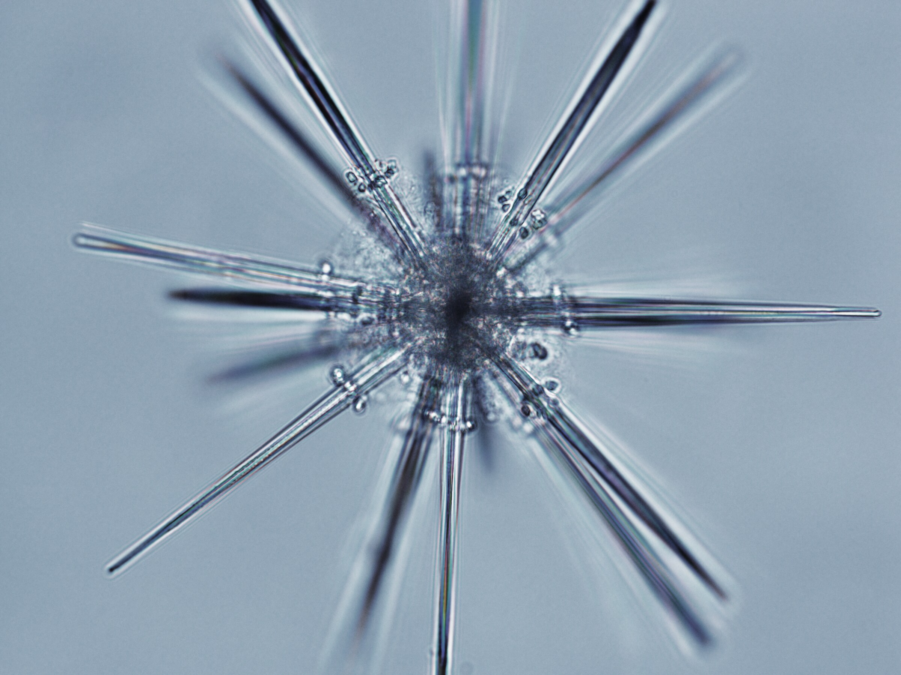
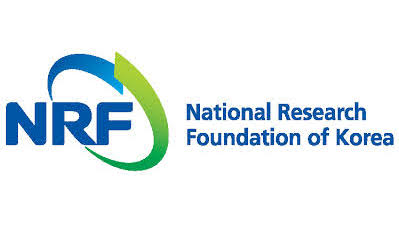
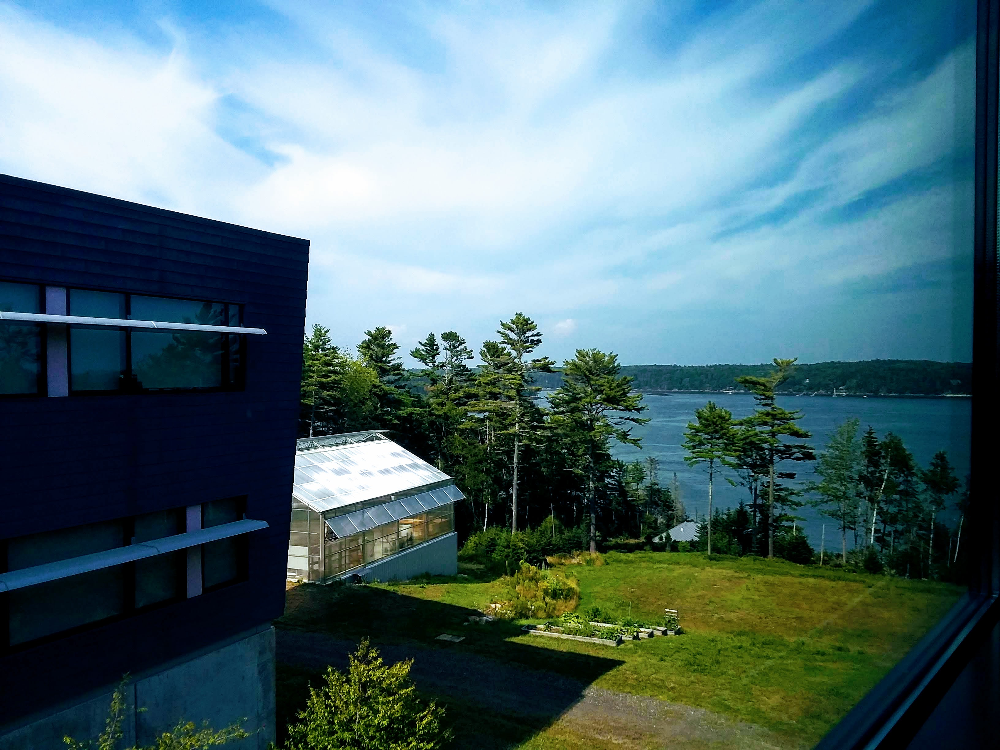

::: {.page-hero .parallax .column-screen style="height: 340px;"}

{fig-alt="Acantharia from the Solomon Islands" style="object-position: center 50%;"}

::: {.hero__scrim}
:::

::: {.page-hero__title}
About Us
:::

:::

::: {.lead}
We study how genetic information shapes the functions, behaviors, and roles of
cells and organisms across the tree of life. The work ranges in scale from the
molecular to the ecological. In practice that has meant building computational
tools to predict how a cell feeds when no one has watched it feed, sequencing
genomes for lineages that have never had one, asking how microeukaryotes sense
and interpret their environment, working out how a green alga lives inside a
salamander embryo, and developing methods to get genome-scale information from
the small amounts of material that deep-sea animals yield. Different problems,
but each one starts from an organism and a question about it, and the
microbiology, molecular biology, and bioinformatics follow from there.
:::

***

::: {.eyebrow}
People
:::

### Principal investigator

::: {.person}
{width=160 height=160 fig-alt="John Burns" style="object-fit: cover; object-position: 15% center;"}

#### John A. Burns

Senior Research Scientist, Bigelow Laboratory for Ocean Sciences.
Research Faculty, Colby College.
Research Associate, American Museum of Natural History.

I received my BA in Geoscience from Franklin and Marshall College, my PhD in
molecular biology from New York University, and completed my postdoctoral
training at the American Museum of Natural History.

[Curriculum vitae](files/JAB_CV_May2026.pdf)
:::

### Joining the lab

New positions depend on funding, but I am always glad to hear from people
interested in the work. [Get in touch](#contact).

### Former lab members

#### Postdocs

- **Baptiste Genot**, 2020–2024. Now a Project Assistant Professor at the [University of Tokyo](https://www.k.u-tokyo.ac.jp/en/index.html).
  <!-- {width=64 height=64 fig-alt="Baptiste Genot" style="object-fit: cover;" .headshot} -->

#### REU students

- **Brooks Osborn**, Colby College, Summer 2024. Now a medical student at the [Tufts University School of Medicine](https://medicine.tufts.edu/).
  <!-- {width=64 height=64 fig-alt="Brooks Osborn" style="object-fit: cover;" .headshot} -->
- **Tyler Bauersfeld**, Southern Maine Community College, Summer 2022. Now a research technician at [IDEXX](https://www.idexx.com/en/).
  <!-- {width=64 height=64 fig-alt="Tyler Bauersfeld" style="object-fit: cover;" .headshot} -->
- **Margaret Grogan**, Fordham University, Summer 2022. Now a Master's student at the Virginia Institute of Marine Science with [Nicole Millette](https://www.vims.edu/research/units/labgroups/phytoplankton_ecology/people/millette_nc.php).
  <!-- {width=64 height=64 fig-alt="Margaret Grogan" style="object-fit: cover;" .headshot} -->
- **Matthew Yost**, University of Maine, Summer 2021. Now a PhD student at the University of Massachusetts Dartmouth with [Katrina Velle](https://katrinavelle.wixsite.com/science).
  <!-- {width=64 height=64 fig-alt="Matthew Yost" style="object-fit: cover;" .headshot} -->
- **Jessica Liu**, Vassar College, Summer 2020.
  <!-- {width=64 height=64 fig-alt="Jessica Liu" style="object-fit: cover;" .headshot} -->
- **Tre-Andice Williams**, Truman State University, Summer 2020.
  <!-- {width=64 height=64 fig-alt="Tre-Andice Williams" style="object-fit: cover;" .headshot} -->

#### Colby semester students

- **Valerie Tonigold**, Southern Maine Community College, Fall 2024. Now an undergraduate student at [Cal State Monterey Bay](https://csumb.edu/).
  <!-- {width=64 height=64 fig-alt="Valerie Tonigold" style="object-fit: cover;" .headshot} -->
- **Caroline Alexander**, Colby College, Fall 2022. Now a Research Technician II at the [Ragon Institute of MGH, MIT and Harvard](https://ragoninstitute.org/).
  <!-- {width=64 height=64 fig-alt="Caroline Alexander" style="object-fit: cover;" .headshot} -->
- **Charis Li**, Colby College, Fall 2020. Now a Master's student at [Harvard Medical School](https://dbmi.hms.harvard.edu/people/charis-li).
  <!-- {width=64 height=64 fig-alt="Charis Li" style="object-fit: cover;" .headshot} -->

***

::: {.eyebrow}
Current support
:::

::: {.logo-block}
{width=120 style="padding: 0.6rem 0.9rem;" fig-alt="Ocean Shot"}

::: {.logo-text}
**Innovating In-Situ Digital Synthesis Strategies for Ocean Species Discovery**
Sasakawa Peace Foundation, Ocean Shot Research Grant Program. 2025 to 2028.
Ship time aboard R/V *Falkor (too)* contributed by Schmidt Ocean Institute.
:::
:::

::: {.content-hidden}
::: {.logo-block}
{width=120 style="background: #16211F; padding: 0.6rem 0.9rem;" fig-alt="The Hypothesis Fund"}

::: {.logo-text}
**Building Radiolarian Genomic Resources as a Research Community**
Hypothesis Fund. 2026 to 2028.
:::
:::
:::

::: {.logo-block}
{width=120 style="padding: 0.6rem 0.9rem;" fig-alt="National Research Foundation of Korea"}

::: {.logo-text}
**Microscopic and genetic investigation into the endogenous viral elements in green algae**
National Research Foundation of Korea. 2025 to 2028.
:::
:::

***

::: {.eyebrow}
Profiles
:::

- [New scientist evolves laboratory's expertise](https://www.bigelow.org/news/articles/2019-10-02.html) Bigelow Laboratory, 2019

***

::: {.eyebrow #contact}
Contact
:::

::: {.figure-row}
{.figure-col fig-alt="View over the water from Bigelow Laboratory"}

::: {.figure-text}
**John A. Burns**\
Bigelow Laboratory for Ocean Sciences\
60 Bigelow Drive, East Boothbay, ME 04544

jburns [at] bigelow.org

- [Google Scholar](https://scholar.google.com/citations?user=DHoJBCAAAAAJ&hl=en)
- [ORCID](https://orcid.org/0000-0002-2348-8438)
- [GitHub](https://github.com/burnsajohn)
- [Bluesky](https://bsky.app/profile/burnsajohn.bsky.social)
- [Bigelow Laboratory profile](https://www.bigelow.org/about/people/jburns.html)
- [Schmidt Ocean Institute profile](https://schmidtocean.org/person/john-burns-2/)
:::
:::
