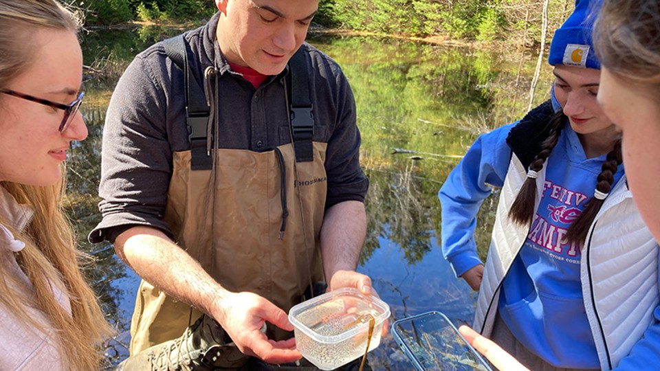
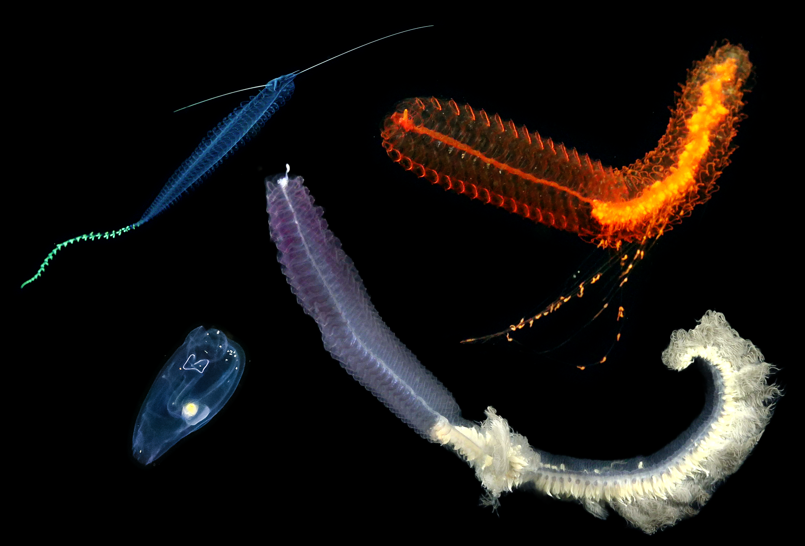
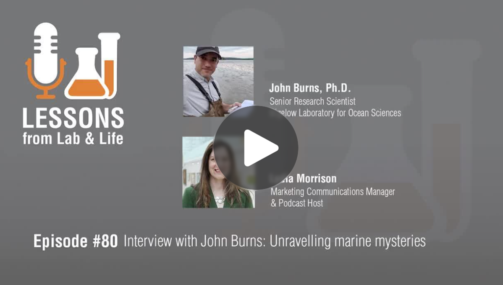
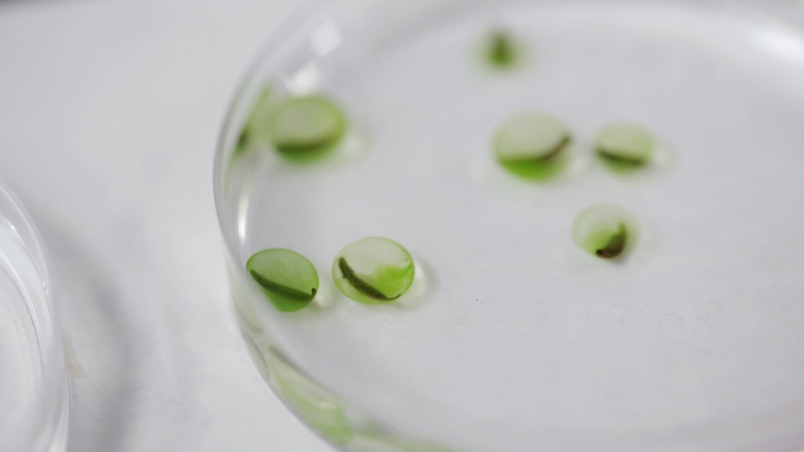
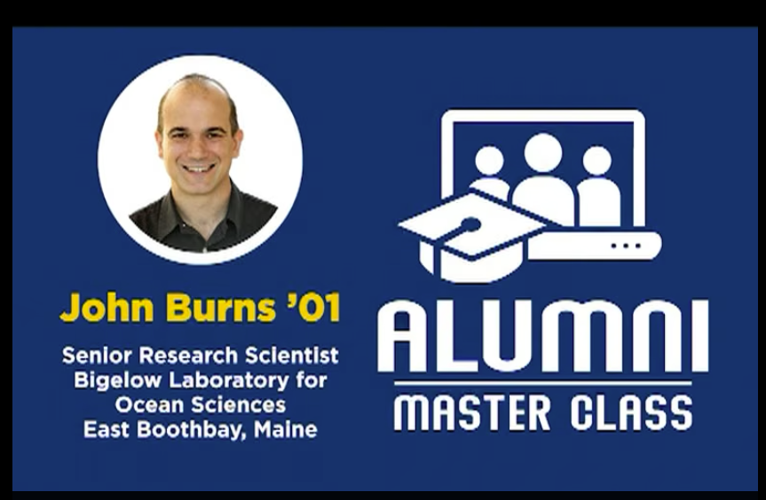
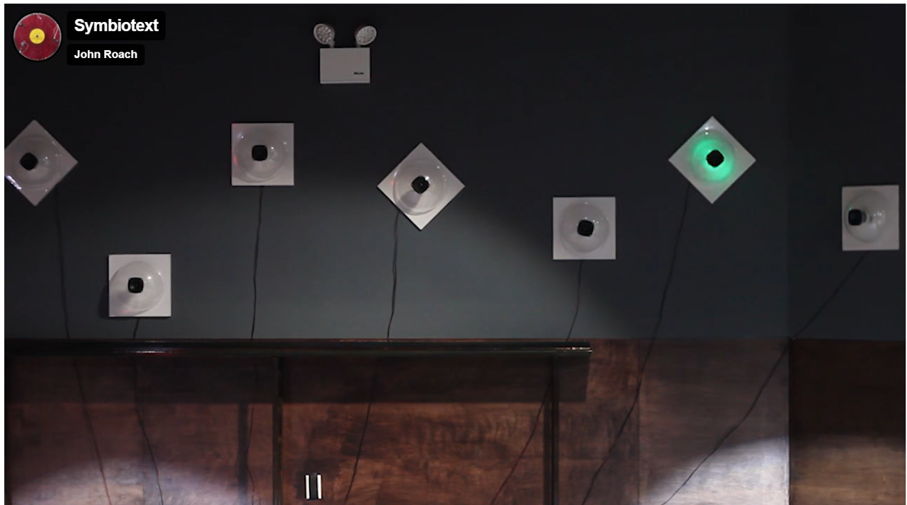
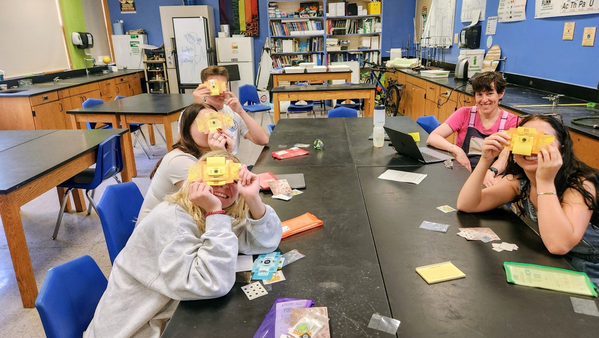
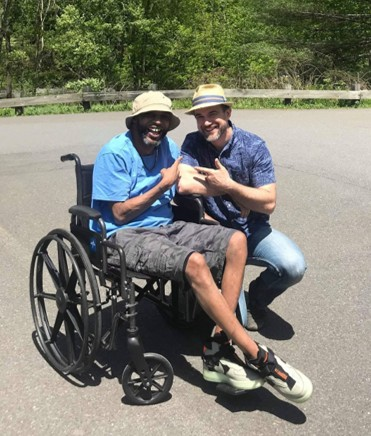

::: {.page-hero .parallax .column-screen style="height: 340px;"}
[{fig-alt="TODO: describe this image"}](images/outreach/bbhs.jpg)
:::

::: {.lead}
Talks, art, and time spent in ponds.
:::

## Talks and interviews

::: {.topic}
### Discovering animals in the deep sea

[{.topic-img fig-alt="Four deep-sea animals"}](https://www.youtube.com/watch?v=bYFDWsiOMVk)

::: {.topic-body}
Café Sci at Bigelow Laboratory for Ocean Sciences, August 2026. A talk on the
Ocean Shot project: recording gelatinous animals intact in the water, and the
tools being built to do it. See the [project page](projects/oceanshot2.qmd) for
the work itself.

[Watch on YouTube](https://www.youtube.com/watch?v=bYFDWsiOMVk)
:::
:::

::: {.topic}
### New England Biolabs podcast

[{.topic-img fig-alt="New England Biolabs podcast episode page"}](https://www.neb.com/en-us/podcasts/podcast-80-interview-with-john-burns)

::: {.topic-body}
May 2026. A conversation ranging across [multicellular development in a close
animal relative](https://doi.org/10.1038/s41586-024-08115-3), the
[Ocean Shot work](projects/oceanshot2.qmd) in the deep sea, and the
[salamander-alga symbiosis](projects/symbiosis.qmd).

[Listen](https://www.neb.com/en-us/podcasts/podcast-80-interview-with-john-burns)
:::
:::

::: {.topic}
### Green Grow the Salamanders

[{.topic-img fig-alt="Green salamander eggs colonized by algae"}](https://www.amnh.org/explore/videos/shelf-life/green-algae-salamanders)

::: {.topic-body}
An episode of the American Museum of Natural History's *Shelf Life* series on
the [salamander-alga symbiosis](projects/symbiosis.qmd), produced by Erin
Chapman and featuring Ryan Kerney and Eunsoo Kim.

[Watch at AMNH](https://www.amnh.org/explore/videos/shelf-life/green-algae-salamanders)
:::
:::

::: {.topic}
### Alumni Master Class

[{.topic-img fig-alt="masterclass splash page"}](https://vimeo.com/showcase/7189020?video=607447505)

::: {.topic-body}
A Master Class for [Franklin & Marshall College](https://www.fandm.edu/)
alumni, September 2021. A circuitous path from nearly failing out of college, through
geoscience, NASA, the USGS, and a sailboat, to molecular biology and protists,
with thanks along the way to the mentors at F&M who made me believe I could.
It ends with the marine science, including the three-week cruise off San Diego
that August.

[Watch on Vimeo](https://vimeo.com/showcase/7189020?video=607447505)
:::
:::

## Writing

::: {.topic}
### Algae living in salamanders, friend or foe?

::: {.topic-body}
A short piece for [TheScienceBreaker](https://doi.org/10.25250/thescbr.brk101),
written with Ryan Kerney, on what the transcriptomes showed about the
[salamander-alga symbiosis](projects/symbiosis.qmd) and why the answer is not
simply one or the other.
:::
:::

## Art and the public

::: {.topic}
### Symbiotext

[{.topic-img fig-alt="The Symbiotext installation"}](https://johnroach.net/symbiotext-with-john-burns-2018/)

::: {.topic-body}
An art-science collaboration with audio artist [John Roach](https://johnroach.net/).
I wrote code that turned the salamander and algal genomes into speech and text,
and Roach built those outputs into
[a dynamic sculpture](https://johnroach.net/symbiotext-with-john-burns-2018/).
Shown in New York in February 2018 as part of
[LIGO: The Art of Science](https://johnroach.net/ligo-the-art-of-science/).
:::
:::

::: {.topic}
### Boothbay Region High School

{.topic-img fig-alt="High school class with foldscopes"}

::: {.topic-body}
Every couple of years I work with the AP biology class at Boothbay Region High
School, at the invitation of their teacher, [Emily Higgins](https://www.boothbayregister.com/article/making-science-real-students/170343). The work included classroom visits and
field studies of salamander eggs.
:::
:::

::: {.topic}
### Rise and Shine Youth Retreat

Night hikes with [Rise and Shine](https://riseandshineyouthretreat.wordpress.com/),
a youth retreat program in Maine. In 2021 and 2022, groups came to Bigelow
Laboratory to learn about salamanders and their eggs, then hiked local preserves
to see the spring migration and breeding. We walked the Pine Tree and Linekin
Preserves of the [Boothbay Region Land Trust](https://bbrlt.org/) in 2021, and
[Hidden Valley Nature Center](https://www.midcoastconservancy.org/hvnc)
in 2022, and on those hikes we watched salamanders mating and laying eggs.

The program ended with the loss of its founder, Nicole Mokeme, in June 2022.

:::

::: {.topic}
### Challenge Yourself to Change

[{.topic-img fig-alt="John Burns with Rocky Sayles in the field"}](https://www.facebook.com/CYTCEastStroudsburg/)

::: {.topic-body}
For several years we ran field and laboratory activities with
[Challenge Yourself to Change](https://www.facebook.com/CYTCEastStroudsburg/),
a youth program in East Stroudsburg, Pennsylvania. Spring salamander egg hunts
and microscopy nights. The program ended when its founder, Rocky Sayles, died.

- Salamander egg hunts:
  [one](https://www.youtube.com/watch?v=8OuLO1FEv_g) ·
  [two](https://www.youtube.com/watch?v=9LX2BRfmnXY)
- [Microscopy night](https://www.facebook.com/share/v/1PA26YtRcn/)
:::
:::
