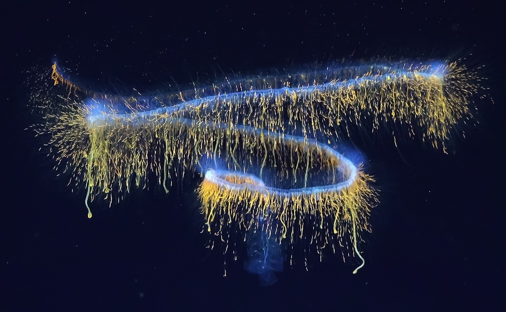
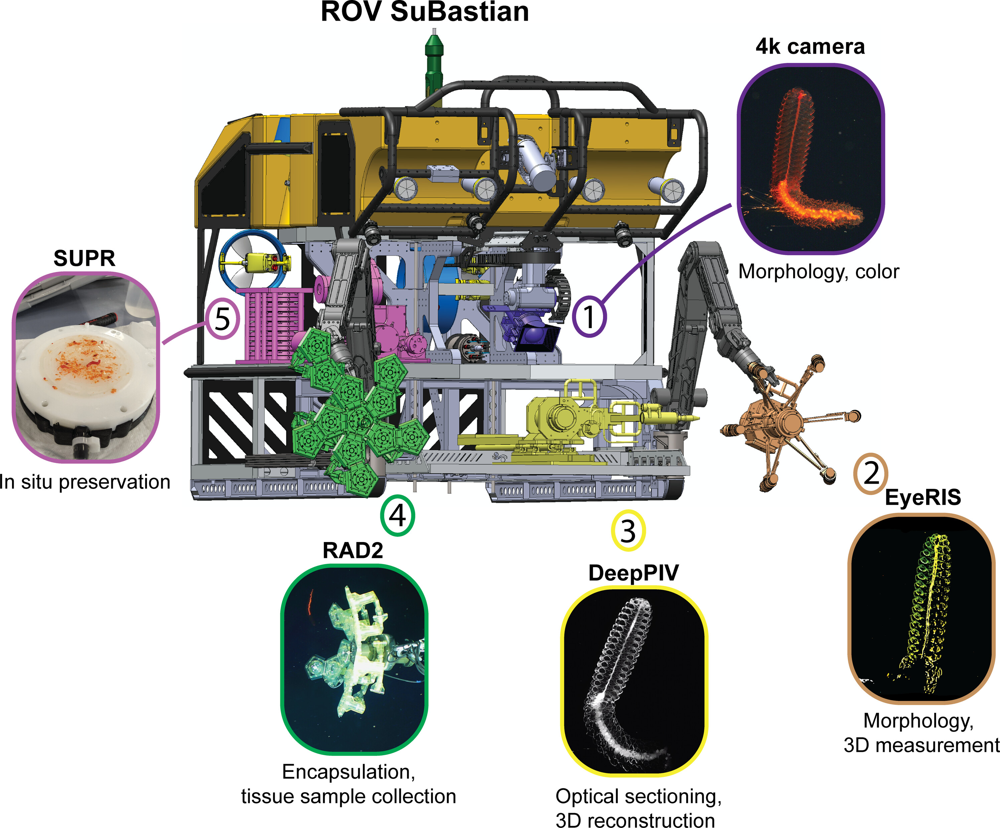
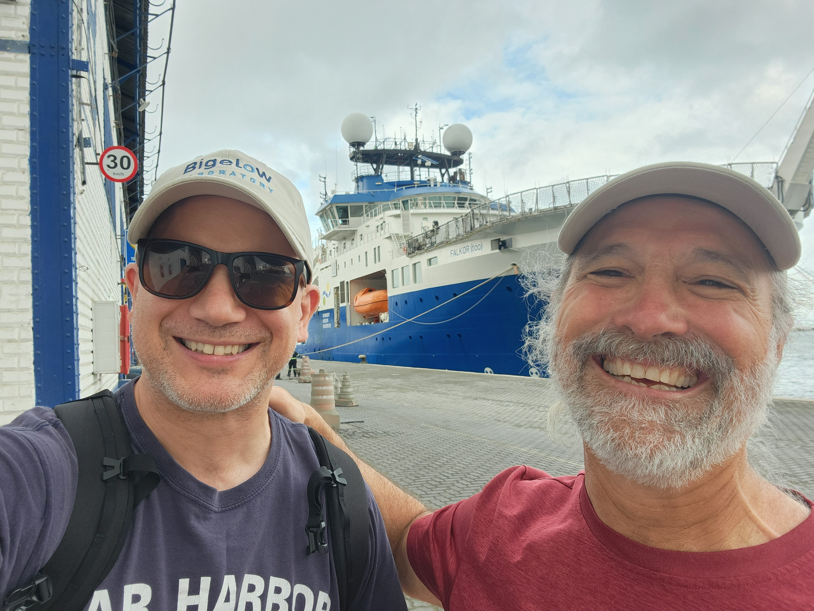
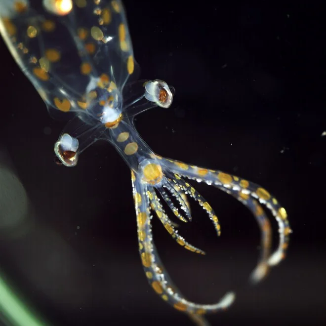
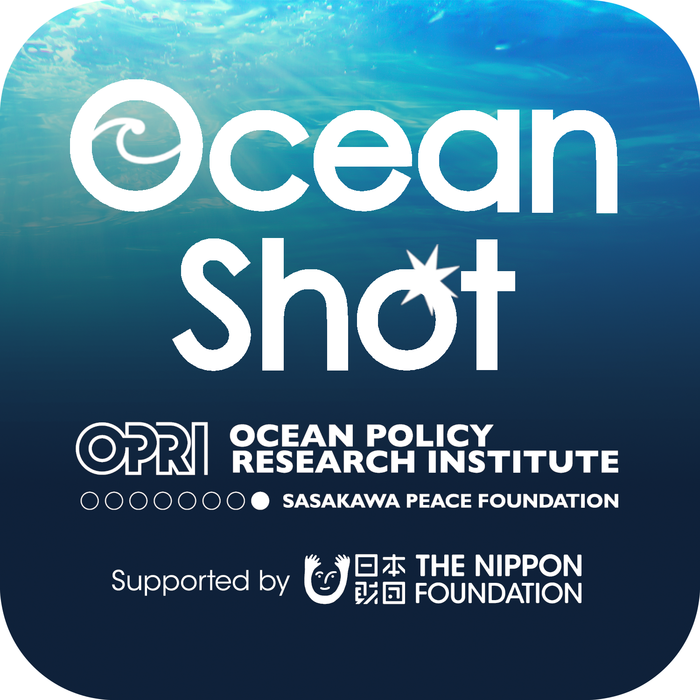
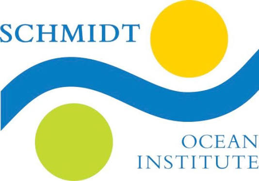

::: {.page-hero style="height: 400px;"}
{.nolightbox fig-alt="Galaxy siphonophore imaged with the ROV SuBastian aboard the RV Falkor (too)" style="object-position: center 65%;"}
:::

::: {.lead}
Much of the gelatinous life in the deep ocean has never been described. Collection damages these animals. We are building tools and methods to record them in the water, intact, with minimal disturbance.
:::

## The problem

The ocean's midwater, below the surface and above the seafloor, is one of the largest contiguous ecosystems on Earth and among the least explored. Much of it is occupied by gelatinous animals: jellyfish, ctenophores, salps, siphonophores, pelagic polychaetes. Estimates suggest that between 35 and 65 percent of gelatinous zooplankton species are poorly described or entirely unknown.

They are hard to study because they are hard to keep. Trawl nets can destroy soft tissue on the way up, and what preservation in ethanol or formalin leaves behind can degrade past usefulness within a few years. Genomic data for these groups barely exist.

## The approach

{.fig-half fig-alt="Outfitting the ROV SuBastian"}

We use a strategy we call **digital synthesis**: assembling enough high-resolution digital information from a single in-situ encounter to formally describe a new species without keeping the animal.

A digital voucher combines quantitative imaging with plenoptic cameras, 3D optical sectioning using laser light-sheet imaging to resolve internal and external structure, and transcriptome and whole-genome sequencing to address function, evolution, and cryptic diversity. Because the voucher is data, it can be shared globally by download rather than by shipping a physical holotype across borders, which is one of the slower steps in describing a new species.

## Where it stands

{.fig-half fig-alt="John and David"}

The strategy was first deployed on [Designing the Future
2](https://schmidtocean.org/cruise/designing-the-future-2/) in 2021, which
produced the method and data papers below. We returned in April and May of 2026
aboard R/V *Falkor (too)* for [Designing the Future
3](https://schmidtocean.org/cruise/designing-the-future-3/), working the midwater
between Salvador and Fortaleza, Brazil, with chief scientist
[Karen Osborn](https://naturalhistory.si.edu/staff/karen-osborn) of the
Smithsonian.

{.fig-half .fig-left fig-alt="Juvenile glass squid"}

::: {.clear-right}
That cruise turned up [31 species new to
science](https://www.bigelow.org/news/articles/2026-06-08.html). I gave a
[public talk on the expedition](https://www.youtube.com/watch?v=bYFDWsiOMVk) at
Bigelow in August 2026.
:::

## People

**John A. Burns**, Bigelow Laboratory for Ocean Sciences, leads the project.

- [**Kakani Katija**](https://www.mbari.org/person/kakani-katija/), Principal
  Engineer and lead of the Bioinspiration Lab, Monterey Bay Aquarium Research
  Institute. In-situ imaging and 3D reconstruction.
- [**Robert J. Wood**](https://seas.harvard.edu/person/robert-wood), Harry Lewis
  and Marlyn McGrath Professor of Engineering and Applied Sciences, Harvard
  Microrobotics Laboratory, Harvard University. Soft robotics for delicate
  manipulation and biopsy.
- [**Brennan Phillips**](https://web.uri.edu/oce/meet/brennan-phillips/),
  Associate Professor of Ocean Engineering, University of Rhode Island.
  Underwater instrumentation and sampling systems.
- [**David Gruber**](https://www.davidgruber.com/), Distinguished Professor of
  Biology, Baruch College, City University of New York.
- [**Dhugal Lindsay**](https://www.jamstec.go.jp/souran/detail.html?systemId=339da5ab7495cc95&lang=en),
  Senior Research Engineer, Japan Agency for Marine-Earth Science and
  Technology. Taxonomy, novel camera systems, and species descriptions.

## Support

### Current Support

::: {.logo-block}
{width=120 .nolightbox fig-alt="Ocean Shot"}

::: {.logo-text}
This work is supported by an [Ocean Shot Award](https://www.spf.org/opri/en/projects/oceanshot.html) from the [Ocean Policy Research Institute](https://www.spf.org/opri/en/) arm of the [Sasakawa Peace Foundation](https://www.spf.org/en/).
:::
:::

::: {.logo-block}
{width=120 .nolightbox fig-alt="Schmidt Ocean Institute"}

::: {.logo-text}
Ship time aboard the R/V *Falkor (too)* was provided by the [Schmidt Ocean Institute](https://schmidtocean.org/).
:::
:::

- [Ocean Shot award propels discovery through innovation](https://www.bigelow.org/news/articles/2025-05-27.html) Bigelow Laboratory, 2025

### Prior Support

::: {.logo-block}
{width=120 fig-alt="Schmidt Ocean Institute"}

::: {.logo-text}
In addition to ship time, the [Schmidt Ocean Institute](https://schmidtocean.org/)
supported the development of this research as *Designing the Future*.
:::
:::

## Related publications

- **Burns JA**, Becker KP, Casagrande D, Daniels J, Roberts P, Orenstein E, Vogt DM, Teoh ZE, et al. (2024). [An in situ digital synthesis strategy for the discovery and description of ocean life](https://doi.org/10.1126/sciadv.adj4960). *Science Advances*.
- **Burns JA**, Daniels J, Becker KP, Casagrande D, Roberts P, Orenstein E, Vogt DM, Teoh ZE, et al. (2024). [Transcriptome sequencing of seven deep marine invertebrates](https://doi.org/10.1038/s41597-024-03533-4). *Scientific Data*.
- Tessler M, Brugler MR, **Burns JA**, Sinatra NR, Vogt DM, Varma A, Xiao M, Wood RJ, et al. (2020). [Ultra-gentle soft robotic fingers induce minimal transcriptomic response in a fragile marine animal](https://doi.org/10.1016/j.cub.2020.01.032). *Current Biology*.
