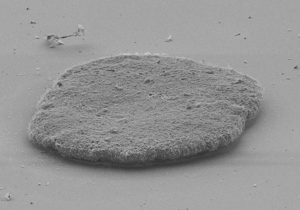
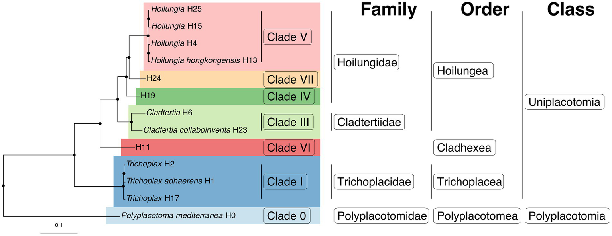

::: {.page-hero .parallax .column-screen style="height: 320px;"}
[{fig-alt="A living placozoan" style="object-position: center 50%;"}](../images/placozoa/Placozoan.webp)
:::

::: {.hero-credit}
Image credit: Michael G. Hadfield,
[CC BY-SA 4.0](https://creativecommons.org/licenses/by-sa/4.0/), via
[Wikimedia Commons](https://commons.wikimedia.org/w/index.php?curid=107727061).
:::

::: {.lead}
Placozoans are flat, millimeter-scale animals with no gut, no nerves, no
muscle, and no front or back. They are genetically diverse and morphologically
almost identical, which is why the phylum went a century with one named species.
:::

## The problem

Placozoans look almost identical to one another, so their genetic variation went
unrecognized for a long time. Sequence and functional differences separate the
groups clearly once you look, and one class of branched placozoans, the
[*Polyplacotomia*]{.taxon}, falls out as a deep-branching lineage.

Their simplicity has often been read as primitiveness, and placozoans have long
been among the candidates for sister to all other animals, alongside sponges and
ctenophores. Where they actually sit is unsettled. The
[*Trichoplax* nuclear genome](https://doi.org/10.1038/nature07191) grouped them
with cnidarians and bilaterians, some analyses recover
[Placozoa as sister to Cnidaria](https://doi.org/10.7554/eLife.36278), and the
root of the animal tree is itself contested, with recent work on
[ancient gene linkages favoring ctenophores](https://doi.org/10.1038/s41586-023-05936-6).

Little is known about how they live, how they reproduce, or what they sense.
What is emerging in this vein suggests more capacity than the body plan implies, and the answer
connects to G protein-coupled receptors. In gorgeous work, Gaspar Jékely's group has shown that
[*Trichoplax*]{.taxon} expresses
[neuropeptides in distinct cell populations and responds to them with specific
behaviors](https://doi.org/10.1016/j.cub.2018.08.067), crinkling, turning, or
flattening depending on the peptide, so a nerveless animal turns out to run on
peptidergic signaling. More recently they deorphanized
[five placozoan GPCRs that respond to monoamines](https://doi.org/10.1016/j.cub.2026.06.017),
four of them sharing ancestry with bilaterian melatonin receptors, and showed
the animal makes those monoamines and changes its speed and shape in response.

## The approach

Sequence and annotate many placozoan genomes from distinct populations, then
compare them in a phylogenomic framework and read the functional differences off
the trees.

The point of doing it that way is that morphology cannot do this job here. In a
classical treatment, the characters that distinguish lineages and carry the
signal for evolutionary patterns are anatomical. Placozoans have few to
work with. So molecular functional characters take their place: gene content,
gene family expansions and losses, and what those imply about how each lineage
lives.

## What we found

::: {.figure-row}
[{.figure-col fig-alt="Linnean classification of placozoans"}](../images/placozoa/phylogeny.webp)

::: {.figure-text}
Protein sequences from seven genomes more than doubled the taxon sampling and
gave the first nuclear phylogenomic reconstruction of all major placozoan
lineages. That produced the first complete Linnaean classification of the
phylum, more than a century after its discovery: two classes, four orders,
three families, a genus, and a species.

[*Polyplacotoma mediterranea*]{.taxon} sits as sister to all other placozoans, a
split we date at over 400 million years. Even that deep divergence sits on a
long branch to other animals, which suggests a bottleneck followed by
diversification.
:::
:::

Adding morphological data to the phylogenomic matrices moved the sister group of
other animals from ctenophores to sponges, which is a live question in animal
phylogeny and a striking amount of movement for a modest amount of data.

## Where it stands

Current work is on transcription factors, stress responses, and sensing across
the placozoan tree, and how each of those varies between lineages.

## People

The placozoan work is led by **Bernd Schierwater** and **Kai Kamm** at the
[Institute of Animal Ecology](https://www.tiho-hannover.de/en/clinics-institutes/institutes/institute-of-animal-ecology),
Stiftung Tierärztliche Hochschule Hannover, and
[**Rob DeSalle**](https://www.amnh.org/research/staff-directory/robert-desalle)
at the American Museum of Natural History. I assemble and annotate the genomes
and do genome-scale functional analyses.

## Support

Ongoing work is not currently funded.

## Related publications

- Tessler M, Neumann JS, Kamm K, Osigus HJ, Eshel G, Narechania A, **Burns JA**, DeSalle R, Schierwater B (2022). [Phylogenomics and the first higher taxonomy of Placozoa, an ancient and enigmatic animal phylum](https://doi.org/10.3389/fevo.2022.1016357). *Frontiers in Ecology and Evolution* 10:1016357.

::: {.hero-credit}
Images from Wikimedia Commons: living placozoan by
[Michael G. Hadfield](https://commons.wikimedia.org/w/index.php?curid=107727061),
CC BY-SA 4.0; [*Trichoplax*]{.taxon} micrograph by
[Oliver Voigt](https://commons.wikimedia.org/w/index.php?curid=754744),
CC BY-SA 3.0.
:::
