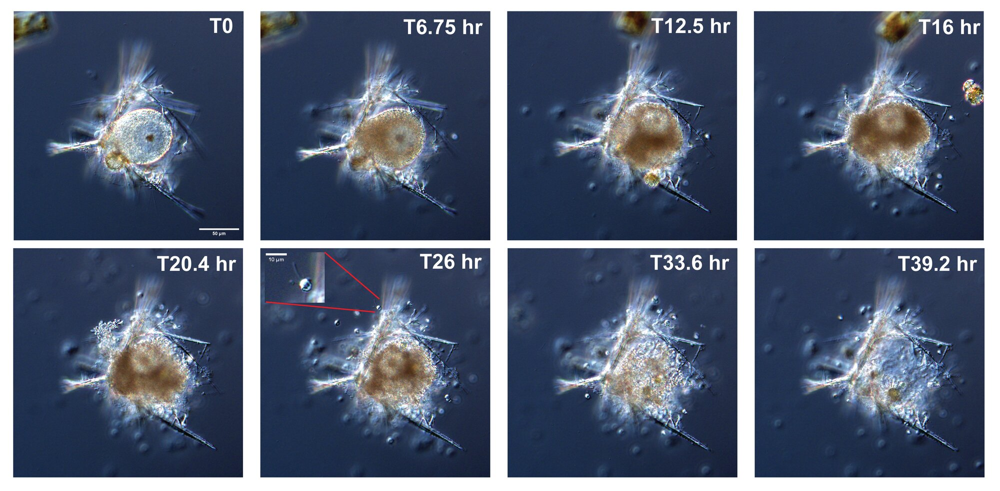
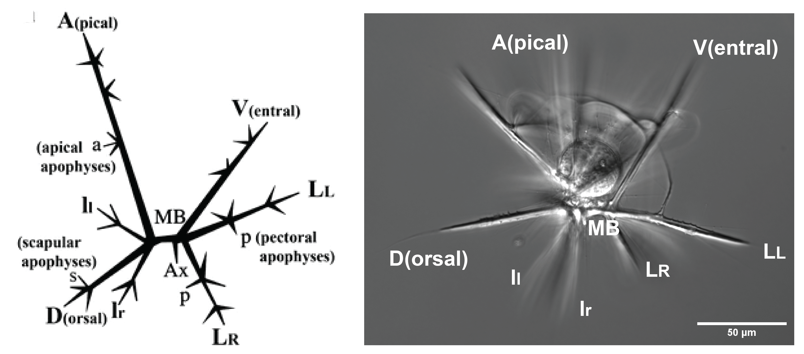
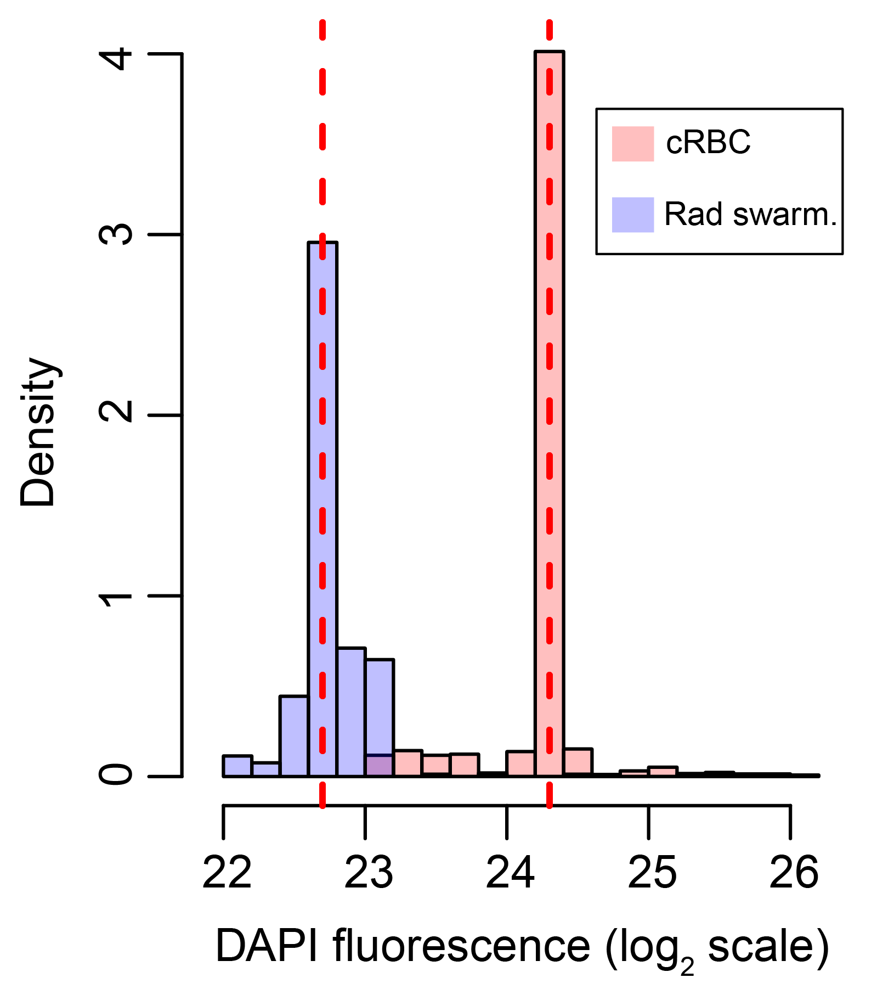
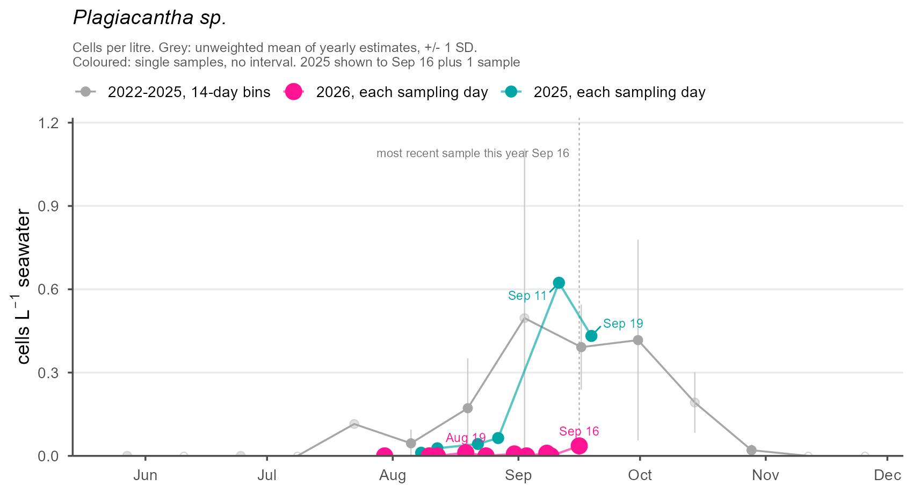
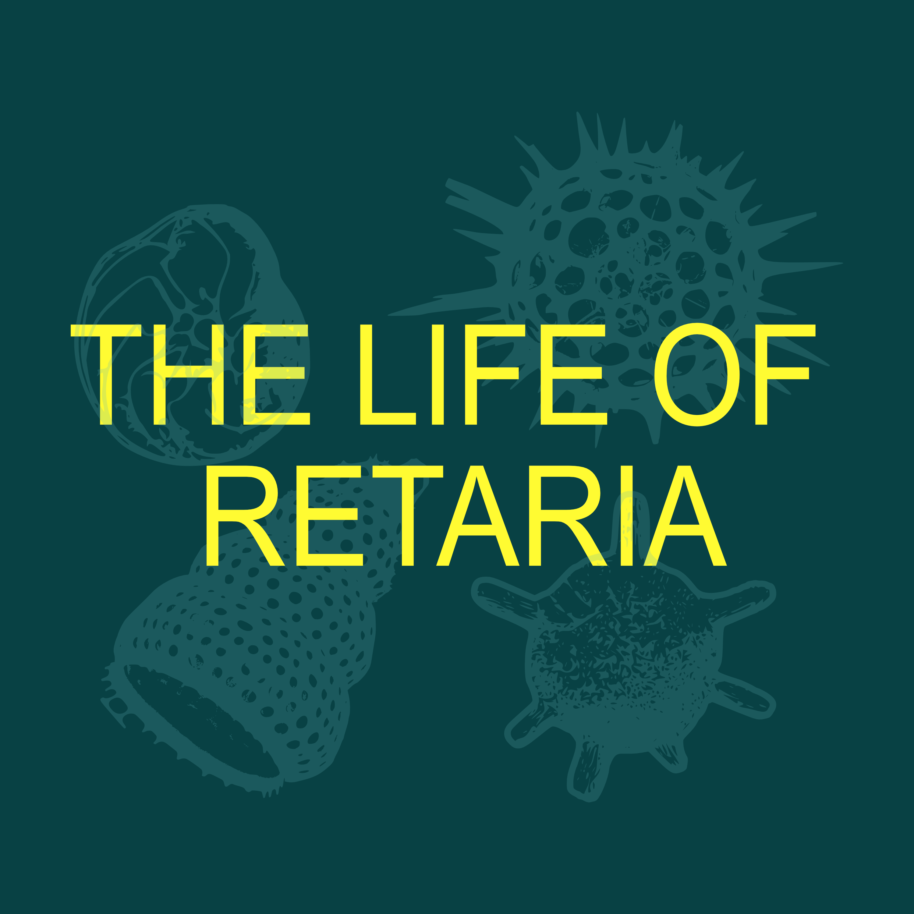

::: {.page-hero .parallax .column-screen style="height: 340px;"}
[{fig-alt="TODO: describe this image" style="object-position: center 80%;"}](../images/plagiacantha/ColorSwarm_TC-01.jpg)
:::

::: {.lead}
A community effort to sequence the first radiolarian genome and establish
[*Plagiacantha*]{.taxon} sp. as a model system.
:::

## Why this species

Radiolarian biology has been largely opportunistic. With no culturable model
species, most of what is known comes from encounters rather than experiments.

::: {.figure-row style="--fig-width: 55%;"}
::: {.figure-stack .figure-stack-side}
<figure>
<a href="../images/plagiacantha/eatdino.mp4">
<video src="../images/plagiacantha/eatdino.mp4" autoplay loop muted playsinline></video>
</a>
<figcaption>Feeding on a dinoflagellate.</figcaption>
</figure>

<figure>
<a href="../images/plagiacantha/eatgreen.mp4">
<video src="../images/plagiacantha/eatgreen.mp4" autoplay loop muted playsinline></video>
</a>
<figcaption>Feeding on a green alga.</figcaption>
</figure>
:::

::: {.figure-text}
Over the past five years we have worked [*Plagiacantha*]{.taxon} sp. into
something tractable: its life stages, bloom cycle, and feeding behavior are
documented. On the molecular side we have a preliminary transcriptome, a partial
single-cell amplified genome, and genome size estimates, and we have developed
cell biological methods including microinjection. No other radiolarian has been
characterized in this much detail.
:::
:::

Four things about the organism make it suitable.

{fig-alt="TODO: describe what the figure labels" style="width: 60%; display: block; margin: 0 auto;"}

**No photosymbionts.** Many radiolarians host dinoflagellate symbionts.
[*Plagiacantha*]{.taxon} does not, which simplifies both sequencing and
cultivation.

**An open skeleton.** Biomineralization is what makes radiolarians useful as
fossil indicators, but a solid skeleton hides the cell. This one is open enough
to watch the central capsule through the whole life cycle.

**Visible structure.** The body plan is relatively simple, but the
characteristic radiolarian features are there and observable: long axopodia, and
the podoconus, the cone of axopodia that nassellarians form.

::: {.figure-row .figure-row-flip style="--fig-width: 20%;"}
{.figure-col fig-alt="Flow cytometry histogram used to estimate genome size"}

::: {.figure-text}
**A manageable genome.** Flow cytometry on swarmer cells puts it around 806
million base pairs. Some radiolarians are estimated above 10 billion, which puts
a high-quality assembly out of reach. This one is within it.
:::
:::

## Tracking the bloom

The [*Plagiacantha*]{.taxon} sp. life cycle follows a predictable schedule,
which is what makes the whole project possible. We sample through the bloom and
post the counts as they come in.

::: {.figure-row}
{.figure-col fig-alt="Cell abundance by sampling date for the current season, plotted against the average of previous seasons"}

::: {.figure-text}
**Last sampled August 31, 2026.**

Average counts cover the period 2022 to 2025. The current season is plotted
against it, with last year's counts carried one sampling date further ahead, so
the plot shows not only where the bloom is but what happened next the last time
around.
:::
:::

## How it works

The project runs as a community effort. Radiolarian researchers, particularly
early career scientists, take part directly in specimen collection, sequencing,
and analysis, so the foundational resources are built collectively.

Three strands run in parallel.

::: {.figure-row style="--fig-width: 32%;"}
![Isolated [*Plagiacantha*]{.taxon} cells.](../images/plagiacantha/IsolatedPlagiacantha.jpg){.figure-col .round fig-alt="Isolated Plagiacantha cells under the microscope"}

::: {.figure-text}
**Sequencing.** The fall bloom supplies material for single-cell whole genome
sequencing. We generate hundreds of single-cell amplified genomes leveraging the
life cycle of [*Plagiacantha*]{.taxon}. We will pair that with PacBio long reads
from thousands of cells gathered in a community collection effort during the
bloom, to scaffold the assembly. Co-assembling the two gives the reference
genome, with annotation done together with participating researchers.
:::
:::

**Molecular tools.** Protocols for gene expression analysis and functional work,
designed to run on field-collected specimens rather than laboratory cultures.
That is what makes them portable: methods that do not require a culture can be
adapted across radiolarian diversity. Culture attempts continue in parallel, but
nothing depends on them succeeding.

**Comparative sampling.** Sequencing at other field sites, extending the same
protocols to additional species, so the work reaches beyond one organism. Those
sites and what turns up at them are on the
[radiolarian biology page](radiolaria.qmd).

Data, protocols, and genomic resources are released through established
repositories as they are validated by the research community.

## Data and protocols

Working data are shared among project participants:

[Project data folder](https://drive.google.com/drive/folders/1JnoAH2qcrBMs_ftvTh1C_X426wuevX-i?usp=sharing)
Participants only

If you are working on the project, or would like to, [get in
touch](../about.qmd#contact).

## People

### 2026 sampling at Bigelow

- **Anna Cho**, Arizona State University
- **Nicole Coots**, University of British Columbia
- **Miguel Méndez Sandín**, Institut de Biologia Evolutiva, CSIC-UPF

::: {.content-hidden}
- **Natalia Llopis Monferrer**, Monterey Bay Aquarium Research Institute
- **Fabrice Not**, Station Biologique de Roscoff
- **Manu Prakash**, Stanford University
- **Ian Probert**, Station Biologique de Roscoff
:::

### Remote participants

- **Leocadio Blanco-Bercial**, Bermuda Institute of Ocean Sciences and Arizona State University
- **Johana Rotterová**, University of Puerto Rico Mayagüez
- **Julia Van Etten**, University of Maryland
- **Jeremy Wideman**, Arizona State University

::: {.content-hidden}
- **Jennifer Beatty**, Station Biologique de Roscoff
- **Tristan Biard**, Université du Littoral Côte d'Opale
- **Anders Kristian Krabberød**, University of Oslo
- **Sarah Trubovitz**, University of California Santa Cruz
- **Sophie Westacott**, University of Bristol
:::

::: {.logo-block .logo-right}
[{width=110 fig-alt="Life of Retaria"}](https://thelifeofretaria.github.io/)

::: {.logo-text}
The project grew out of a proposal to [Life of
Retaria](https://thelifeofretaria.github.io/), a group of early career
researchers organizing the global community of people working on living
retarians.
:::
:::

## Support

::: {.content-hidden}
::: {.logo-block .logo-left}
{width=120 .nolightbox style="background: #16211F; padding: 0.6rem 0.9rem;" fig-alt="The Hypothesis Fund"}

::: {.logo-text}
This work is supported by [The Hypothesis Fund](https://hypothesisfund.org/).
:::
:::
:::

More on [radiolarian biology](radiolaria.qmd).
