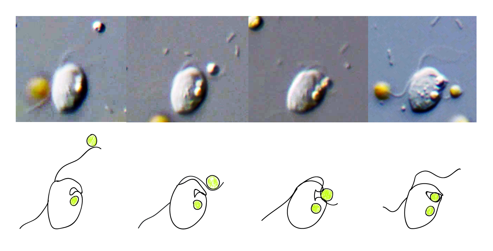
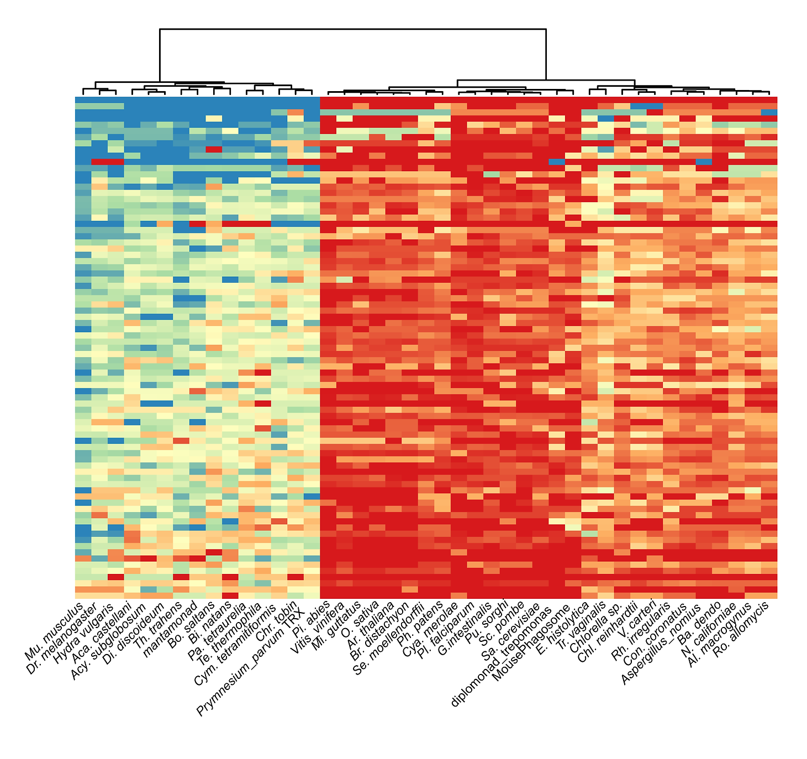
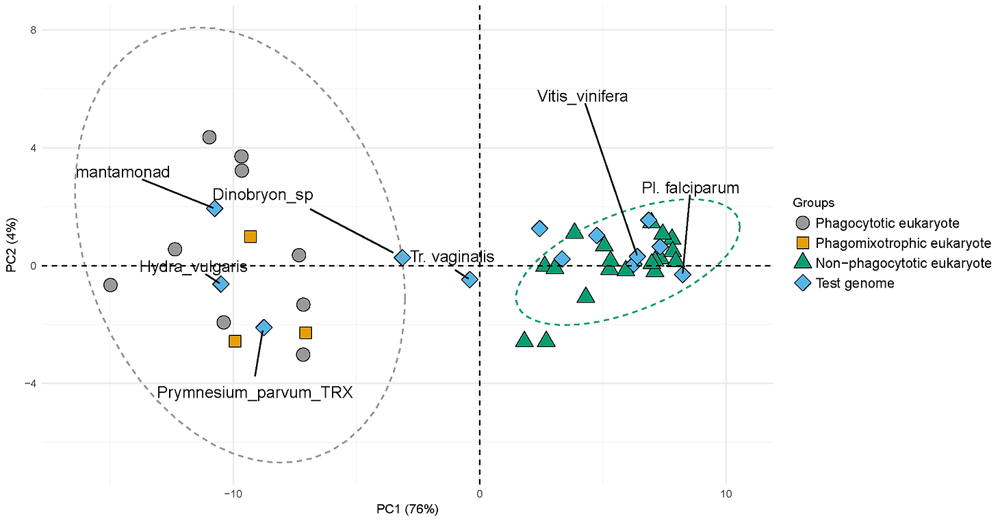
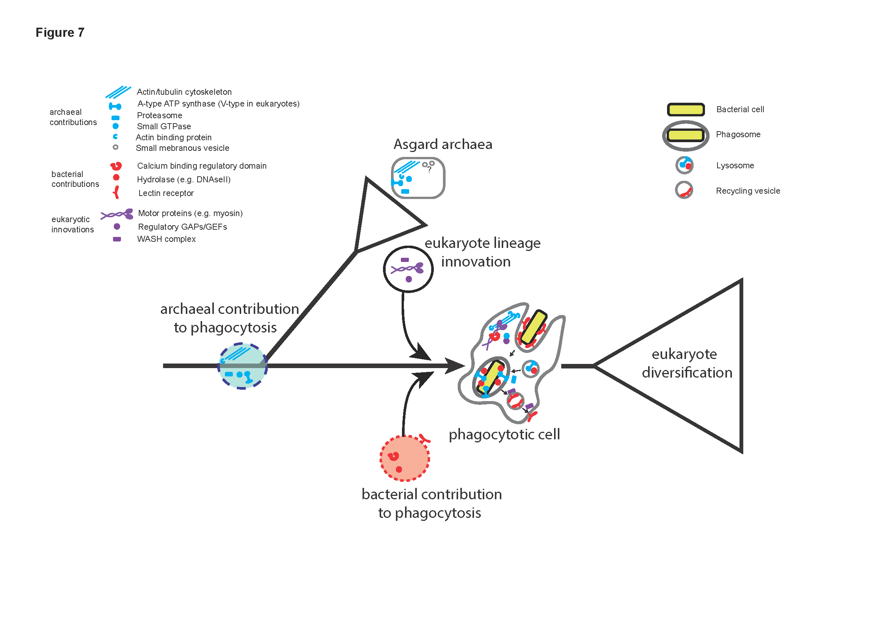

::: {.page-hero .parallax .column-screen style="height: 420px;"}
[{fig-alt="The cryptistid Roombia feeding on an alga"}](../images/prediction/RoombiaFeed1.png)
:::

::: {.lead}
For lineages known only from sequence, inferring how the cell lives from what its
genome encodes.
:::

## The problem

How does the information coded in an organism's DNA relate to what that organism
does? The question is old and the general answer is hard. But a narrower version
is tractable: rather than tracing individual genes to individual functions, look
at patterns of gene presence and absence across the whole tree of life, sampled
evenly, and ask which combinations travel together.

Supervised clustering on those patterns defines sets of genes that link distant
organisms to a shared function. An organism you have never observed feeding can
then be scored on whether it has the genomic equipment to feed.

## The approach

### Functional mapping of genome-scale data

::: {.figure-row}
{.figure-col fig-alt="Heatmap of protein cluster abundance across organisms"}

::: {.figure-text}
Each row is a cluster of proteins acting in a similar functional process. Each
column is an organism. The colors are a weighted score for how many proteins
that organism has in that process. Machine learning inference on patterns like
these is what produces a prediction.
:::
:::

### Principal component analysis of functional maps

::: {.figure-row .figure-row-flip}
{.figure-col fig-alt="Principal component ordination separating organisms by functional capacity"}

::: {.figure-text}
The same data reduced to principal components separates organisms into clusters
by functional capacity, which is easier to read than the full matrix and shows
the same structure.
:::
:::

## What we found

### Multiple origins of the genes predictive of phagocytosis

::: {.figure-row}
{.figure-col fig-alt="Evolutionary origins of phagocytosis-predictive gene families"}

::: {.figure-text}
The genes that predict phagocytosis in eukaryotes do not share a single
evolutionary origin. They come from archaea, from bacteria, and from apparent
innovation within the eukaryote lineage. Searching across diversity is what
linked cell eating to its prokaryotic roots.
:::
:::

## Where it stands

The computational tool [Predict Trophic Mode](../resources.qmd) came out of this
project. Future work will update the predictive framework with modern machine
learning algorithms and an expanded comparative genomic catalog.

## People

**John A. Burns**, Bigelow Laboratory for Ocean Sciences.

This work began at the American Museum of Natural History, with
[Alexandros Pittis](https://imbb.forth.gr/en/research/Alexandros-Pittis.62/),
now at the Institute of Molecular Biology and Biotechnology, FORTH, and
[Eunsoo Kim](https://pure.ewha.ac.kr/en/persons/eunsoo-kim/), now at Ewha Womans
University.

## Support

### Current Support

We are currently seeking support for this line of research.

### Prior Support

::: {.logo-block}
{width=140 fig-alt="Simons Foundation"}

::: {.logo-text}
The [Simons Foundation](https://www.simonsfoundation.org/) supported this work
through award SF-382790.
:::
:::

## Related publications

- **Burns JA**, Pittis AA, Kim E (2018). [Gene-based predictive models of trophic modes suggest Asgard archaea are not phagocytotic](https://doi.org/10.1038/s41559-018-0477-7). *Nature Ecology & Evolution*.
- Jimenez V, **Burns JA**, Le Gall F, Not F, Vaulot D (2021). [No evidence of phago-mixotrophy in *Micromonas polaris* (Mamiellophyceae), the dominant picophytoplankton species in the Arctic](https://doi.org/10.1111/jpy.13125). *Journal of Phycology*.
- Bock NA, Charvet S, **Burns J**, Gyaltshen Y, Rozenberg A, Duhamel S, Kim E (2021). [Experimental identification and in silico prediction of bacterivory in green algae](https://doi.org/10.1038/s41396-021-00899-w). *The ISME Journal*.
- Liu J, Williams T, **Burns JA** (2021). [Relating genome completeness to functional predictions](https://doi.org/10.1101/2021.10.01.462806). Preprint.
