::: {.page-hero .parallax .column-screen style="height: 250px;"}
[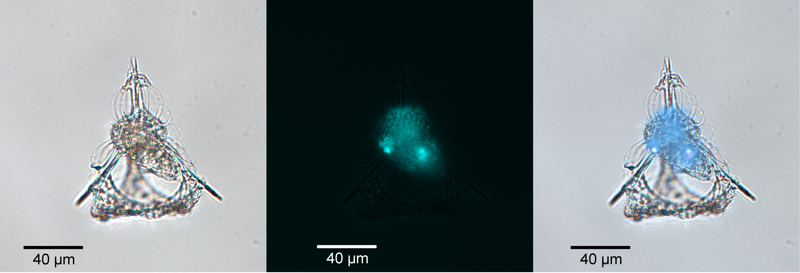{fig-alt="..." style="object-position: center 95%;"}](../images/radiolaria/Clathrocanium_SolomonIslands2016.png)
:::

::: {.lead}
Radiolarians have been studied since the 1800s and have never been grown in the
laboratory. Almost everything known about how these cells actually work comes
from watching them alive, in the hours between collection and death.
:::

## The problem

Radiolarians have existed on Earth for about as long as animals. They are abundant across
the open ocean gyres, and they build cytoskeletal and mineral structures unlike
anything in the groups we know well.

They also cannot be cultured, which means the usual routes into a cell are
closed. No cell lines, no mutants, no standing supply of material. What is left
is fieldwork and microscopy: find the cells, keep them alive, and watch.

<!-- TODO: a paragraph on what specifically remains unknown. Feeding, motility,
     skeleton construction, the axopodial system. Naming the open questions is
     what turns "understudied" into a research programme. -->

## Where we sample

Radiolarians are widespread in the oceans. In deep oligotrophic waters we find
a diverse assemblage; in shallow water the species we encounter are more
constrained. We collect at the Bigelow dock in Maine during the late summer and
early fall bloom, and have sampled in Bermuda, Puerto Rico, Norway, the
Mediterranean, and the central Atlantic.

### Gulf of Maine

::: {.figure-row}
![Top row: [*Sticholonche*]{.taxon} sp., [*Plagiacantha*]{.taxon} sp., unknown colony. Bottom row: [*Acanthometron*]{.taxon} sp., [*Lithomelissa*]{.taxon} sp. 1, [*Lithomelissa*]{.taxon} sp. 2.](../images/radiolaria/MaineRads_3yrs.png){.figure-col fig-alt="Six radiolarian morphospecies collected in the Gulf of Maine"}

::: {.figure-text}
In the nearshore estuaries of the Gulf of Maine we see a small number of species
with strong seasonality. Three morphospecies turn up predictably year on year,
all in late summer and early fall: [*Plagiacantha*]{.taxon}, a nassellarian,
[*Acanthometron*]{.taxon}, an acantharian, and [*Sticholonche*]{.taxon}, a
taxopodid. A [*Lithomelissa*]{.taxon} species appears occasionally.

That narrowness limits what this site can say about radiolarian ecology
globally. For a cell biologist it is the opposite of a limitation: one species,
in numbers, on a schedule.
:::
:::

### Bermuda

::: {.figure-row .figure-row-flip}
{.figure-col fig-alt="Montage of radiolarian morphospecies collected off Bermuda"}

::: {.figure-text}
Bermuda sits in the Western North Atlantic, in the Sargasso Sea, surrounded by deep oligotrophic water, and
the radiolarian assemblage there is correspondingly broad. A few miles from the
Bermuda Institute of Ocean Sciences we can sample below 1000 m and find a
multitude of forms.

In the waters off of Bermuda, rhizarians are often the most numerically abundant cells at depth, which still
means only roughly one cell in tens of litres of seawater. Concentrating from more
than 100,000 litres gives us a sample dense enough to pick a couple of hundred
cells from a few 10s of millilitres.

They feed passively. Prey drifts into the long axopodia of radiolarians,
acantharians, and foraminiferans, or into the cytoplasmic nets of phaeodarians,
and is caught. The larger individuals and the colonial species take small
animals.
:::
:::

### Puerto Rico

::: {.figure-row}
![Morphospecies from the Caribbean, including a tropical [*Plagiacantha*]{.taxon} in the second row.](../images/radiolaria/PuretoRicoRADS1-01.png){.figure-col fig-alt="Montage of radiolarian morphospecies collected off southern Puerto Rico"}

::: {.figure-text}
We sampled south into the Caribbean from the University of Puerto Rico
Mayagüez's marine campus on Isla Magueyes. The assemblage there is different
again, with tropical spumellarians and again a wide range of forms.

The second row of the figure includes a [*Plagiacantha*]{.taxon} that looks very
like the Maine cells. We lost it before we could sequence it, which is the
comparison we most wanted.

From Isla Magueyes it is about seven miles due south to water over 500 m deep,
and the diversity there is high. On the shallow shelf in between, covered in natural coral reefs, we found a few unhealthy acantharians, but no radiolarians.
:::
:::

## Approach
Everything here runs on field-collected cells, which shapes the methods. Live
imaging while the cells are still behaving, fixation and microscopy for
structure, and single-cell sequencing where a genome is what the question needs.

<video controls preload="metadata">
  <source src="../images/radiolaria/RadTrap.mp4" type="video/mp4">
</video>
<video controls preload="metadata">
  <source src="../images/radiolaria/AcanthSwarm.mp4" type="video/mp4">
</video>

::: {style="text-align: center;"}
[![Ultrastructure expansion microscopy of [*Plagiacantha*]{.taxon} sp., showing microtubules along the spicules and forming other organized structures in the cell.](../images/radiolaria/RAD_UEXM.png){fig-alt="Expansion microscopy image of a Plagiacantha cell with microtubules labelled" style="width: 50%;"}](../images/radiolaria/RAD_UEXM.png)
:::

Radiolaria genome sequencing has its own page: the
[*Plagiacantha* genome project](../projects/plagiacantha-genome.qmd), a community effort
to build the first radiolarian genome and a model system with it.

### Collaborators

- [**Jeremy Wideman**](https://evocellbio.com/), Arizona State University.
  Organellar genome organization, sequencing, and assembly.
- [**Johana Rotterová**](https://www.microttlab.org/), University of Puerto Rico
  Mayagüez. Molecular diversity of protists, with expertise in ciliates and
  anaerobes, and collection in Puerto Rico.
- [**Leocadio Blanco-Bercial**](https://search.asu.edu/profile/4317967),
  Bermuda Institute of Ocean Sciences and Arizona State University. Radiolarian
  and zooplankton ecology.
- [**Derk Joester**](https://joester.mccormick.northwestern.edu/), Northwestern
  University. Biomineralization and materials characterization.

## The wider community

::: {.logo-block .logo-right}
[{width=200 fig-alt="Life of Retaria"}](https://thelifeofretaria.github.io/)

::: {.logo-text}
[Life of Retaria](https://thelifeofretaria.github.io/) is a group of early
career researchers organizing the global community of people who work on living
retarians, sharing data and ideas across labs. Anyone working on these organisms
should know about it.
:::
:::

## In the field

<!-- TODO: a line or two on what collecting involves. The boat, the net,
     the hours at the scope before the cells die. A bare photo grid on a
     research page reads as decoration; one sentence connects it to the
     "keep them alive and watch" line above. -->

::: {.gallery}

[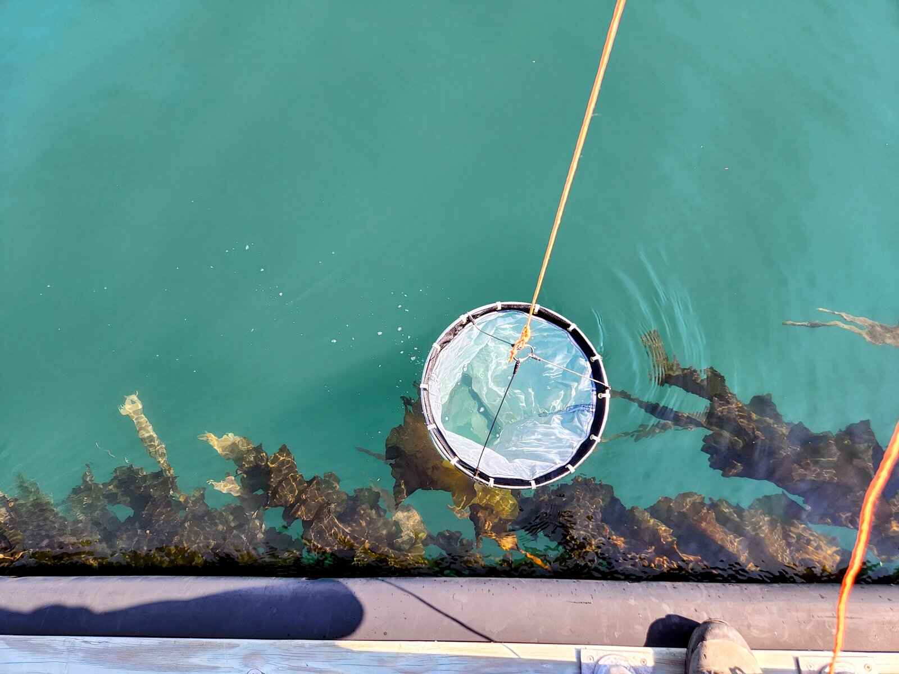{fig-alt="TODO"}](../images/radiolaria/sampling/sampling-2022-03-18.jpg)

[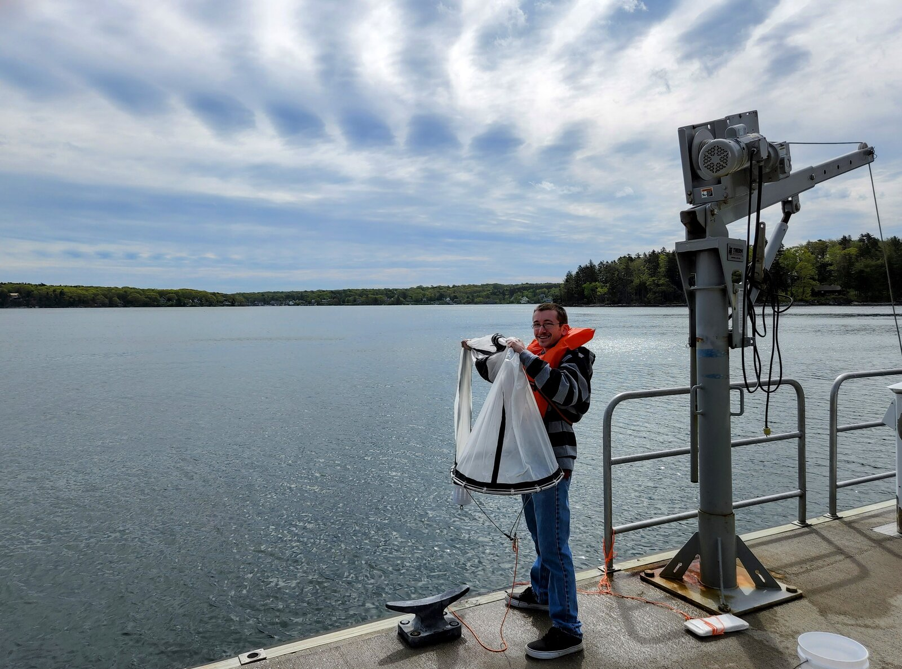{fig-alt="TODO"}](../images/radiolaria/sampling/sampling-2022-05-26.jpg)

[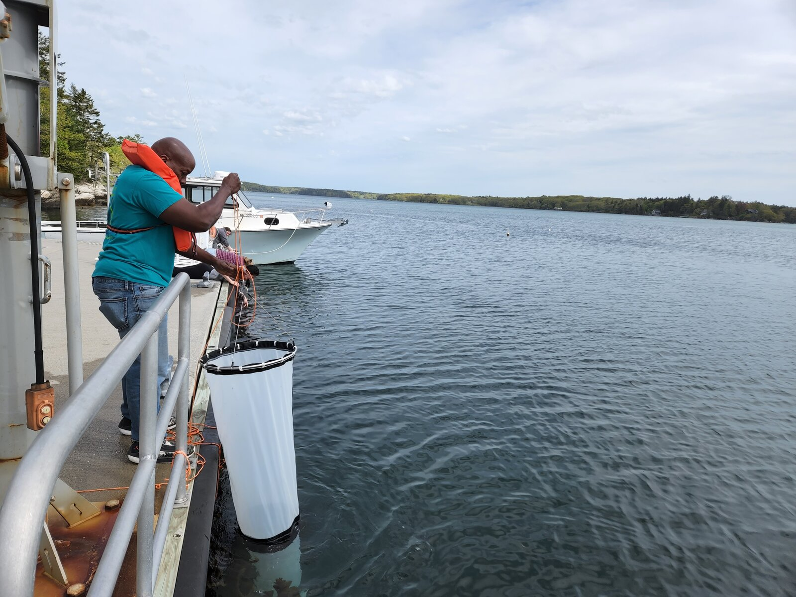{fig-alt="TODO"}](../images/radiolaria/sampling/sampling-2022-05-26-2.jpg)

[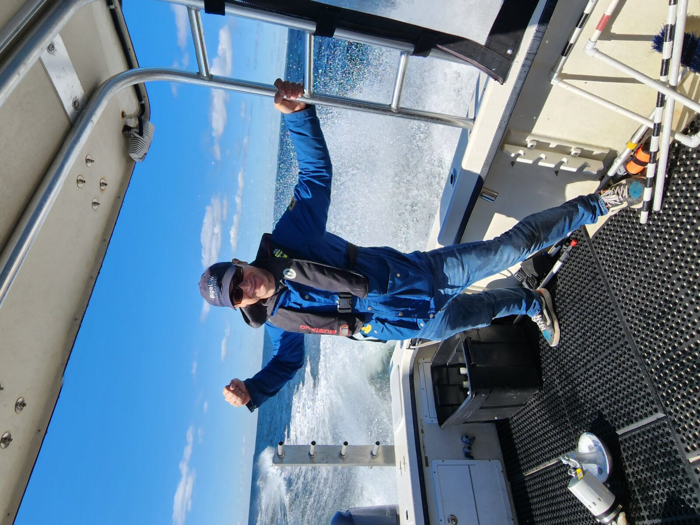{fig-alt="TODO"}](../images/radiolaria/sampling/sampling-2022-09-29.jpg)

[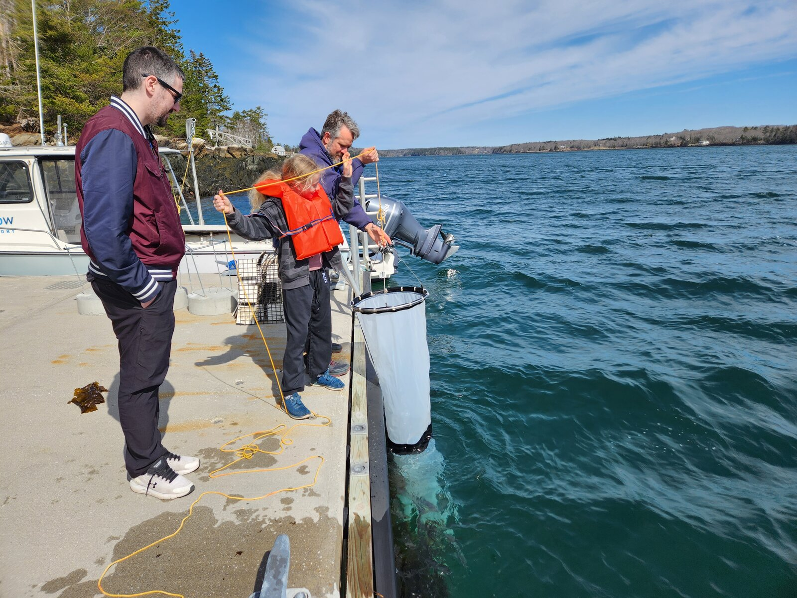{fig-alt="TODO"}](../images/radiolaria/sampling/sampling-2023-04-12.jpg)

[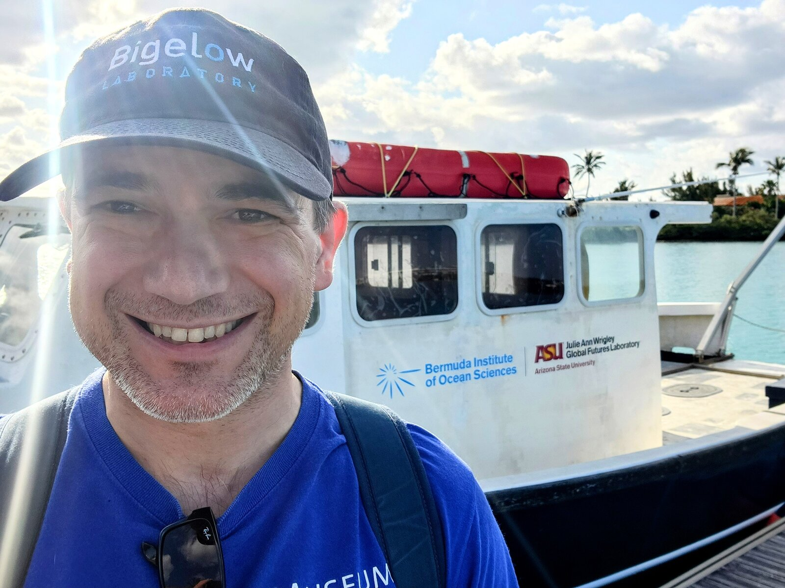{fig-alt="TODO"}](../images/radiolaria/sampling/sampling-2023-05-12.jpg)

[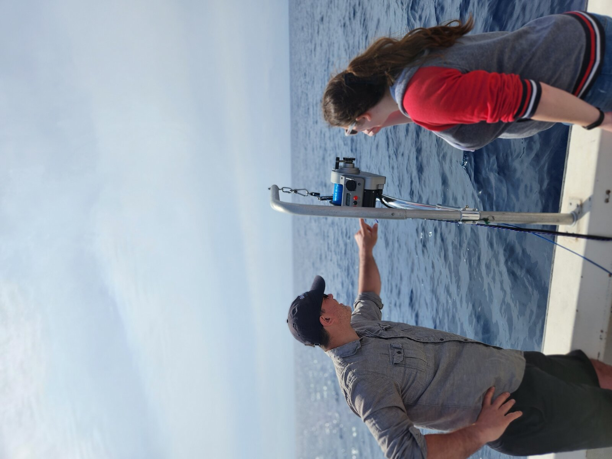{fig-alt="TODO"}](../images/radiolaria/sampling/sampling-2023-05-16.jpg)

[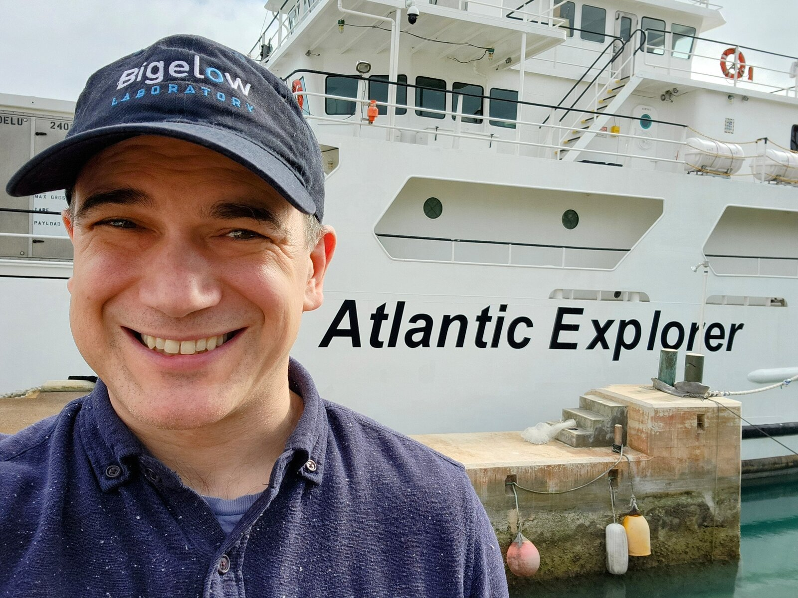{fig-alt="TODO"}](../images/radiolaria/sampling/sampling-2024-03-09.jpg)

[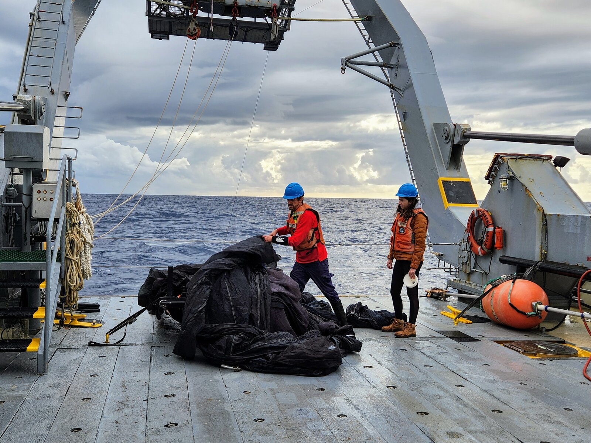{fig-alt="TODO"}](../images/radiolaria/sampling/sampling-2024-03-14.jpg)

[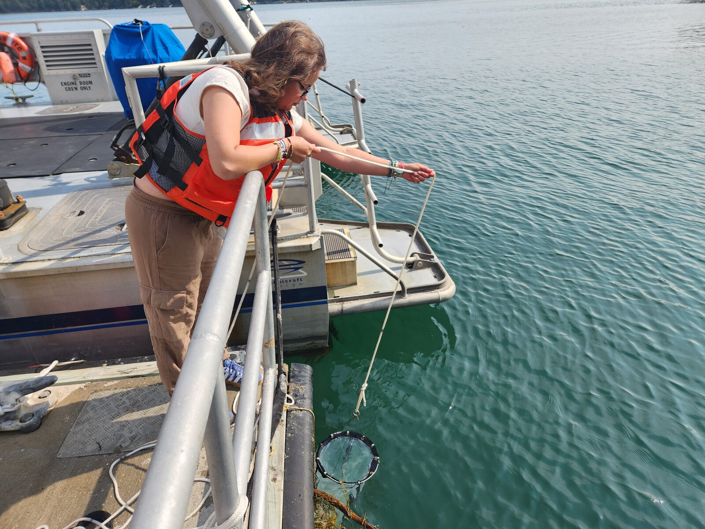{fig-alt="TODO"}](../images/radiolaria/sampling/sampling-2024-09-12.jpg)

[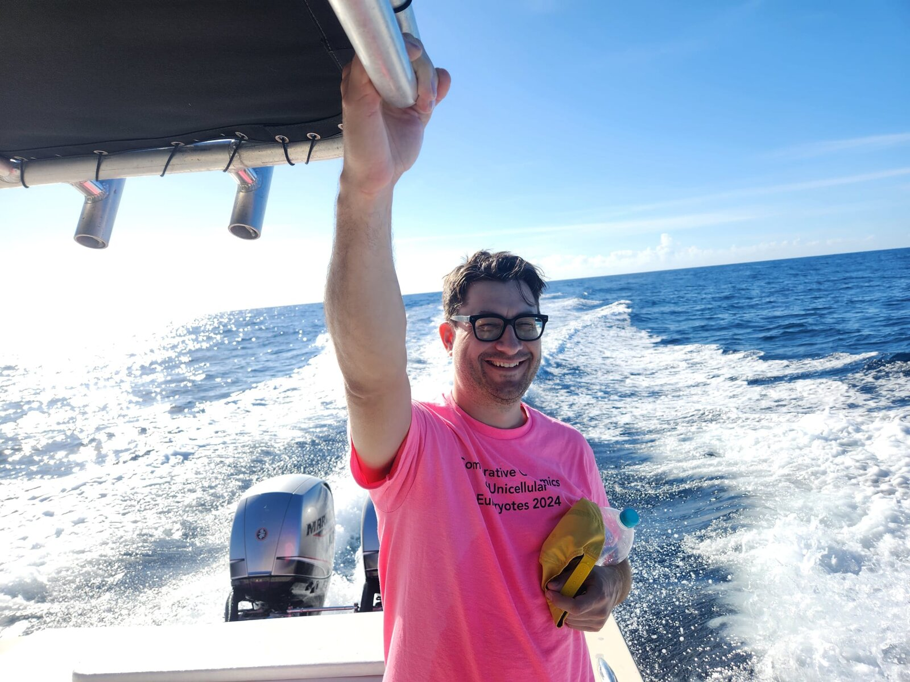{fig-alt="TODO"}](../images/radiolaria/sampling/sampling-2024-12-10.jpg)

[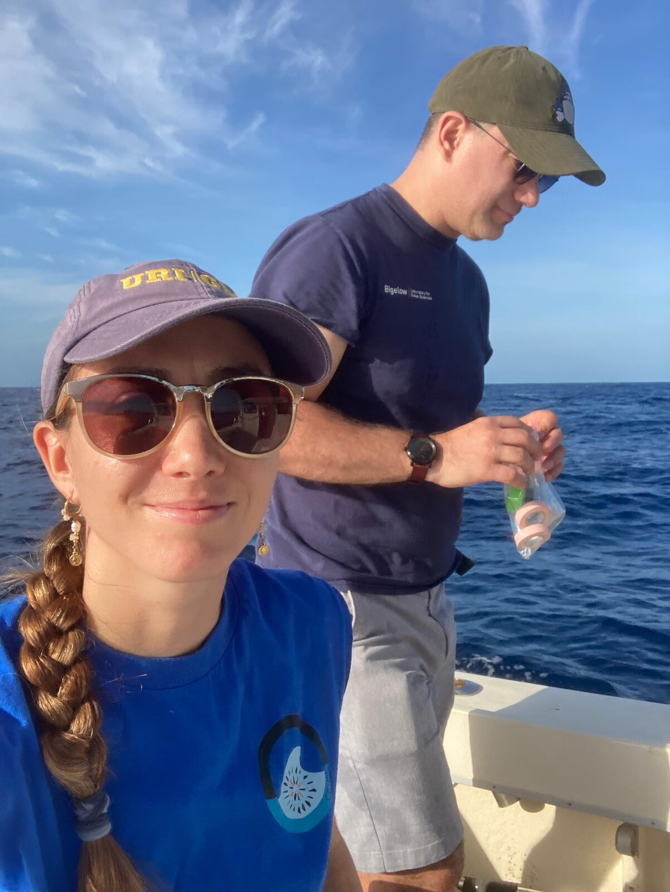{fig-alt="TODO"}](../images/radiolaria/sampling/sampling-2024-12-10-2.jpg)

[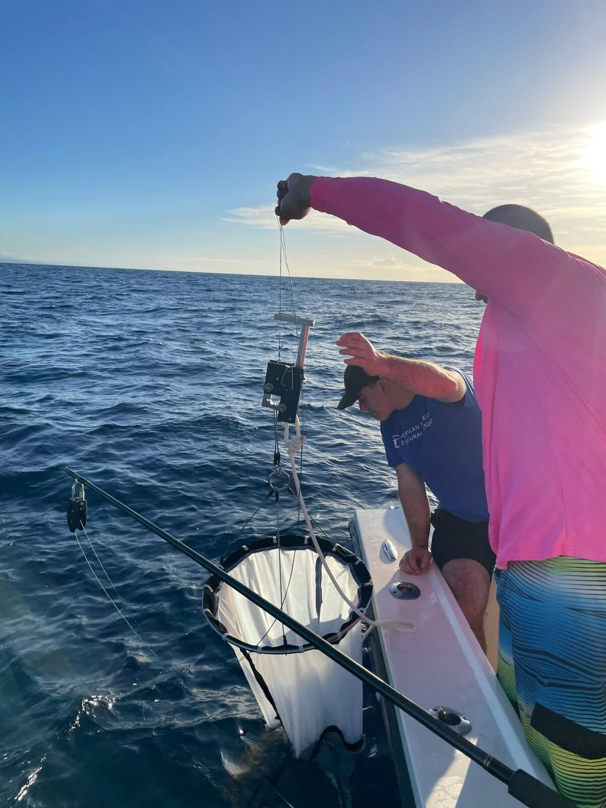{fig-alt="TODO"}](../images/radiolaria/sampling/sampling-2024-12-10-3.jpg)

[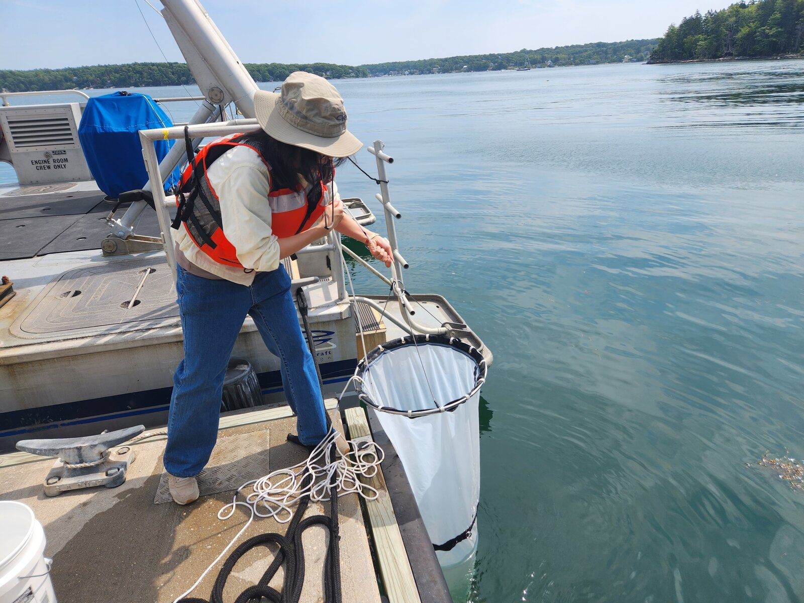{fig-alt="TODO"}](../images/radiolaria/sampling/sampling-2025-08-08.jpg)

:::

## Support

::: {.content-hidden}
::: {.logo-block}
{width=120 style="background: #16211F; padding: 0.6rem 0.9rem;" fig-alt="The Hypothesis Fund"}

::: {.logo-text}
The [*Plagiacantha* genome project](plagiacantha-genome.qmd) is supported by
[The Hypothesis Fund](https://hypothesisfund.org/).
:::
:::

That grant covers the genome. The rest of the work here, the comparative
sampling and the cell biology, is unfunded, and radiolarian research broadly
remains so. We are currently seeking support for other research avenues. If you are interested in supporting it, [get in
touch](../about.qmd#contact).
:::
