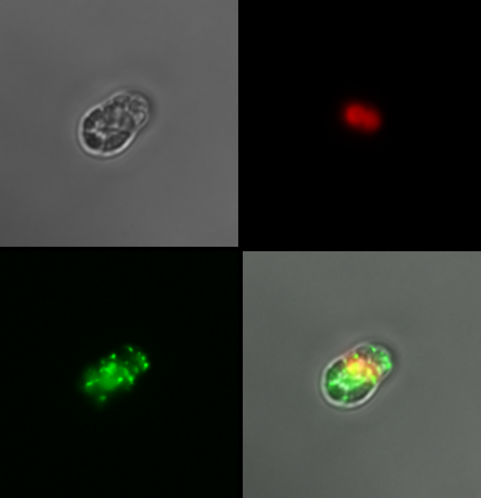
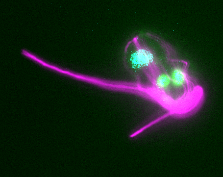
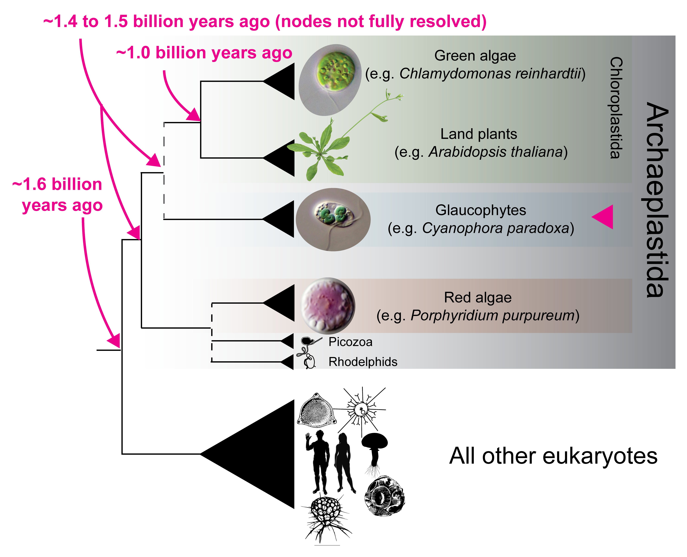

<!--
::: {.page-hero .parallax .column-screen style="height: 320px;"}
[{fig-alt="Cyanophora paradoxa responding to ACC by producing H2O2"}](../images/cellsignaling/ACC_glaucoFull.png)
:::
-->

<!--
::: {.page-hero .parallax .column-screen style="height: 320px;"}
[{fig-alt="SEM image of Cyanophora paradoxa"}](../images/cellsignaling/Cparadoxa.png)
:::
-->

::: {.page-hero .parallax .column-screen style="height: 320px;"}
[{fig-alt="Expansion microscropy with Cyanophora paradoxa"}](../images/cellsignaling/Cyanophora_expand.png)
:::

::: {.lead}
Like plants and animals, microbial eukaryotes communicate with one another. We know very little about how these processes work and how they evolve.
:::

## The problem

![Drought stress in crops, and osmotic stress in [*Cyanophora*]{.taxon} shown by redox fluorescence. The same problem at two scales.](../images/cellsignaling/Listen.png){.fig-half fig-alt="Crops under drought stress alongside fluorescent glaucophyte cells responding to osmotic stress"}

Microalgae are the main primary producers in aquatic systems, and like plants
they have to cope with changing temperature, light, nutrients, toxins, and
competition. Plants handle this with a chemical vocabulary: ethylene, abscisic
acid, jasmonic acid, and salicylic acid coordinate stress responses within a
plant, and volatile compounds and root exudates carry the information to
neighbors.

Whether microalgae do anything comparable is almost entirely unstudied. Being
unicellular, they also have options plants do not, working at the population
level through stochastic switching and rapid mutation. Which of these a
glaucophyte uses is unknown.

## The approach

{.fig-half fig-alt="Phylogeny showing glaucophytes as sister to green algae and land plants"}

Our first look at signaling in microeukaryotes was in [Cyanophora
paradoxa]{.taxon}, a glaucophyte, chosen for two reasons that pull in opposite
directions. 1) It is unusual: glaucophytes are one of the three Archaeplastida
lineages descended from the [presumed] original plastid endosymbiosis. 2) Modern 
phylogenies also place glaucophytes as the sister lineage to green algae
and land plants, which is where nearly everything known about cell signaling in
photosynthetic organisms comes from. So it is far enough from the models to be
worth asking, and close enough that the answers are interpretable.

No glaucophyte has had transgenic tools, so the work so far has been
high-throughput rather than mechanistic: measure what the cells do when given a
signal, map where the signaling proteins actually sit, and read out
phosphorylation and transcription to see how the signal gets from the outside of
the cell to the genome. 

## What we found

::: {.figure-row .figure-row-flip}
![A working model of stress signaling in [*Cyanophora paradoxa*]{.taxon}.](../images/cellsignaling/signalingModel.jpg){.figure-col fig-alt="TODO: describe the pathway shown"}

::: {.figure-text}
[*Cyanophora paradoxa*]{.taxon} makes ethylene under abiotic stress. It will
also make it on demand: supplied with ACC, the precursor land plants use, the
cells release ethylene as a gas.

The response looks like a signaling pathway rather than an isolated reaction.
Reactive oxygen species accumulate after both stress and ACC treatment,
consistent with a second messenger carrying the signal inward. Abscisic acid, a
second plant hormone, interferes with ethylene synthesis from ACC while
promoting ROS accumulation, so the two hormones interact. Cells treated with ACC
grow more slowly, and their transcriptomes show upregulation of
senescence-associated proteases, which fits what the growth data show.
:::
:::

## Where it stands

Three directions are open. Which signals are used, and what carries them
inward once received. Whether signaling between cells coordinates a response
across a population, and whether a cell that receives a warning survives a
later stress better than a naive one. And how a signal is integrated in cells
whose architecture has no close parallel, where inference from homology gives
out and the proteins have to be located directly.

[Cyanophora]{.taxon} is where we started, not where this stops. The same
questions apply across microbial eukaryotes, and the answers are unlikely to be
the same in each.

The work is unfunded at present and continues opportunistically. If you work on
signaling in microbial eukaryotes and want to talk, [get in
touch](../about.qmd).

## Press

- [Study illuminates cues algae use to 'listen' to their environment](https://www.bigelow.org/news/articles/2024-07-02.html) Bigelow Laboratory, 2024
- [Maine lab explores whether stressed-out algae could help replace plastics](https://www.pressherald.com/2024/09/26/maine-lab-explores-whether-stressed-out-algae-could-help-replace-plastics/) Portland Press Herald, 2024

### Collaborators

- **Baptiste Genot**, University of Tokyo. Led the glaucophyte hormone work.
- **Stephen Archer**, Bigelow Laboratory for Ocean Sciences. Trace gas measurement.

## Support

Currently seeking support for this work.

## Related publications

- Genot B, Grogan M, Yost M, Iacono G, Archer SD, **Burns JA** (2024). [Functional stress responses in Glaucophyta: evidence of ethylene and abscisic acid functions in *Cyanophora paradoxa*](https://doi.org/10.1111/jeu.13041). *Journal of Eukaryotic Microbiology*.
