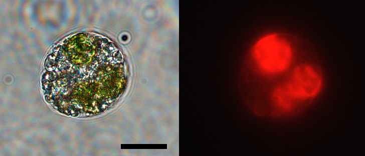

::: {.page-hero .parallax .column-screen style="height: 300px;"}
{fig-alt="Light sheet reconstruction of a stage 34 embryo with algae highlighted" style="object-position: center 50%;"}
:::

::: {.lead}
The green alga [*Oophila amblystomatis*]{.taxon} grows inside the egg capsules of
the spotted salamander, and in some cells, inside the embryo itself. It is the
only known case of a photosynthetic cell living inside the tissues of a
vertebrate.
:::

## The problem

::: {.figure-row}
.](../images/salsymbio/eggmasses_Hangarter.png){.figure-col fig-alt="Spotted salamander egg masses, green with algae"}

::: {.figure-text}
The first observation of green salamander eggs in the scientific literature is
from the naturalist Henry Orr in 1888. Orr wrote that the developing eggs of
[*Amblystoma*]{.taxon} [sic] "seem to present a remarkable case of symbiosis,"
and went on: "I have not discovered how the algae enter the membrane, nor what
physiological effect they have on the respiration of the embryo, but it seems
probable that in this latter respect they may have an important influence."
Nearly 140 years later we understand a good deal about the mechanisms and
dynamics of the salamander-alga symbiosis, and Orr's first question stands: we
still do not know how the algae get into the eggs.
:::
:::

::: {.figure-row .figure-row-flip}
{.figure-col fig-alt="Single salamander cell with three algae inside"}

::: {.figure-text}
In 2011, [Ryan Kerney and colleagues](https://doi.org/10.1073/pnas.1018259108)
found that the egg-colonizing algae also enter embryonic tissues and individual
cells. This is the only such case recorded in a vertebrate, and it is the
exception that proves the rule: the algae are tolerated in an embryo, before
adaptive immunity is established. That constraint holds, because at embryonic
stages the host salamander's immune system is not yet developed.
:::
:::

## History

In the 1940s, seminal work by [Perry
Gilbert](https://doi.org/10.2307/1931284) established the mutualism: embryos
developing with algae hatch earlier, larger, and more successfully than those
without.

In 1958, [Hutchison and
Hammen](https://doi.org/10.2307/1539111) measured oxygen
utilization in the association, and in 1962 the same pair followed carbon
fixation in the egg (Hammen and Hutchison, *Life Sciences* 1:527–532). The
carbon paper concluded that the association was not simply algal fixation
followed by transfer to the embryo. They found instead that the embryos fix a
considerable amount of inorganic carbon themselves. We [reconfirmed and extended
this in 2020](https://doi.org/10.3389/fmicb.2020.01815), controlling for
heterotrophic carbon fixation by the embryo and finding competition for carbon
dioxide within the egg at early developmental stages.

::: {.figure-row}
.](../images/salsymbio/oxygenCartoon2.png){.figure-col fig-alt="Oxygen concentration inside salamander eggs in light and dark"}

::: {.figure-text}
In 1986, [Bachmann, Carlton, Burkholder, and
Wetzel](https://doi.org/10.1139/z86-239) put an oxygen electrode inside the eggs
themselves. In darkness oxygen was severely depleted, so whatever diffusion
delivers through the jelly is not enough. In light it rose fast, past
saturation, even when the water around the mass was close to anoxic. The oxygen
an embryo has comes from photosynthesis, not from the pond.
:::
:::

In 1994, [Pinder and Friet](https://doi.org/10.1242/jeb.197.1.17) showed why the
symbiosis matters so much to salamander embryos. Unlike wood frog egg masses,
which host the same alga but are loose enough for water to circulate between
eggs, spotted salamander masses are firm with no convective route at all.
Diffusion cannot supply oxygen to the embryos in the middle, especially late in
development, and the algae make up the difference. They also documented the
daily swing: the egg mass goes hyperoxic in the light, and at night both algae
and embryo consume oxygen, driving the eggs to a low oxygen state.

The 2011 finding by [Kerney and colleagues](https://doi.org/10.1073/pnas.1018259108)
reignited interest in the association.

In 2014, [Small, Bennett, and Bishop](https://doi.org/10.1007/s13199-014-0297-8)
observed ammonia uptake by algae in egg masses. In addition to supplying oxygen,
the algae remove waste products that would otherwise build up to toxic levels in
the diffusion-limited egg.

Also in 2014, [Kim and colleagues](https://doi.org/10.1371/journal.pone.0108915)
mapped the phylogenetic relationships of [*Oophila*]{.taxon}, showing that the
egg-associated algae form a clade across diverse amphibian hosts. Algae from the
same group have since been identified in salamanders in
[Japan](https://doi.org/10.1111/pre.12173) and frogs in
[Europe](https://doi.org/10.1007/s00114-021-01734-0).

::: {.figure-row .figure-row-flip}
, CC BY.](../images/salsymbio/ExpressionCartoon.jpg){.figure-col fig-alt="Diagram of transcriptional changes in host and algal cells during the endosymbiosis"}

::: {.figure-text}
In 2017, we looked at [transcriptional regulation during the
endosymbiosis](https://doi.org/10.7554/eLife.22054) and found that the
endosymbiotic algae are stressed and fermenting, while the host cells show an
altered but muted immune signal and otherwise appear to tolerate them well.
:::
:::

## Where it stands

Work continues on [population structure](https://doi.org/10.3389/famrs.2025.1609494)
and [phylogenetics](https://doi.org/10.1016/j.ympev.2024.108165) in the alga, and on
[genetic tools](https://doi.org/10.1007/s13199-022-00861-0) for working with it. We
are currently doing metabolomics and transcriptomics on the system in collaboration
with others. The system suits both questions of its own and broader ones about
symbiosis, immunity, and how a cell finds its way through a crowded fluid.

### Collaborators

- **Ryan Kerney**, Gettysburg College. Salamander development.
- **Eunsoo Kim**, Ewha Womans University. Protist phylogenetics and cell biology.
- **Cory Bishop**, St. Francis Xavier University. Embryo physiology and the egg capsule environment.
- **Baptiste Genot**, University of Tokyo. Cell biology of the symbiosis.
- **Wendy Strangman** and **Robert Williamson**, University of North Carolina Wilmington. Natural products chemistry.
- **Vera Nikitashina** and **Georg Pohnert**, Friedrich Schiller University Jena. Metabolomics.
- **Gaëlle Toullec** and **Johan Decelle**, Université Grenoble Alpes. Subcellular imaging, through the [AtlaSymbio](https://photosymbiosis.com/research/atlasymbio/) project.

## Support

### Current support

Currently seeking support for projects in this system.

### Prior support

::: {.logo-block}
{width=140 fig-alt="Gordon and Betty Moore Foundation"}

::: {.logo-text}
The [Gordon and Betty Moore Foundation](https://www.moore.org/) supported much
of our work on this system.
:::
:::

::: {.logo-block}
{width=110 fig-alt="National Science Foundation"}

::: {.logo-text}
The National Science Foundation funded my initial involvement through
[award 1428065](https://www.nsf.gov/awardsearch/showAward?AWD_ID=1428065).
:::
:::

An award from the William Procter Scientific Innovation Fund let us begin
exploring natural products and immune interactions in the symbiosis.

## Related publications

- Wallace SE, **Burns JA**, Hale RE, Kerney RR, Mott CL, Bishop CD (2025). [High partner specificity in an algal-salamander mutualism at continental scale](https://doi.org/10.3389/famrs.2025.1609494). *Frontiers in Amphibian and Reptile Science*.
- Genot B, **Burns JA** (2022). [Transformation of the symbiotic alga *Oophila amblystomatis*: a new tool for animal-algae symbiosis studies](https://doi.org/10.1007/s13199-022-00861-0). *Symbiosis*.
- Yang H, Genot B, Duhamel S, Kerney R, **Burns JA** (2022). Organismal and cellular interactions in vertebrate-alga symbioses. *Biochemical Society Transactions*.
- **Burns JA**, Kerney R, Duhamel S (2020). [Heterotrophic carbon fixation in a salamander-alga symbiosis](https://doi.org/10.3389/fmicb.2020.01815). *Frontiers in Microbiology*.
- Kerney R, Leavitt J, Hill E, Zhang H, Kim E, **Burns J** (2019). [Co-cultures of *Oophila amblystomatis* between *Ambystoma maculatum* and *Ambystoma gracile* hosts show host-symbiont fidelity](https://doi.org/10.1007/s13199-018-00591-2). *Symbiosis*.
- **Burns JA**, Zhang H, Hill E, Kim E, Kerney R (2017). [Transcriptome analysis illuminates the nature of the intracellular interaction in a vertebrate-algal symbiosis](https://doi.org/10.7554/eLife.22054). *eLife*.
- Kerney R, **Burns J**, Kim E (2016). [Investigating mechanisms of algal entry into salamander cells](https://doi.org/10.1142/9781786340580_0007). In *Algal and Cyanobacteria Symbioses*.
