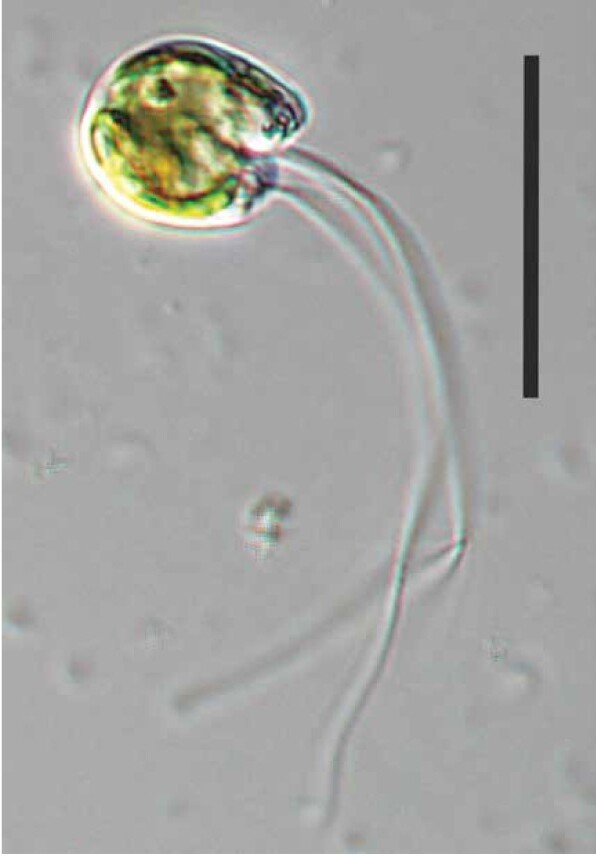

::: {.page-hero .parallax .column-screen style="height: 200px;"}
[{fig-alt="Cymbomonas tetramitiformis cells" style="object-position: center 35%;"}](../images/algavirus/cymbomonas.jpg)
:::

::: {.lead}
Green algal genomes carry the remains of past viral infections. In
[*Cymbomonas tetramitiformis*]{.taxon} there are a great many of them, and we do
not yet know how they interact with the algal cell.
:::

## The problem

[*Cymbomonas tetramitiformis*]{.taxon} is an early diverging green alga that
feeds both ways: it photosynthesizes and it eats bacteria. In 2015 we published
[an initial genome assembly](https://doi.org/10.1093/gbe/evv144) built from
short reads, which was the standard approach then and the reason a large
part of the genome was missing. Short-read assemblies collapse repeats, and
repeats are where integrated viral sequence tends to sit.

## What we found

::: {.figure-row}
, CC BY.](../images/algavirus/cymboViruses.jpg){.figure-col fig-alt="Summary of viral genomes identified in the Cymbomonas tetramitiformis assembly"}

::: {.figure-text}
A new hybrid assembly using Oxford Nanopore long reads together with Illumina data
improved both the size and the contiguity of the genome, and the repeat regions
that came back with it were full of viruses.

Among them: the complete 400 kb genome of a giant Algavirales virus, the first
record of the uncultured viral family AG_03 in a green alga. Many integrated
Polinton-like viruses, 15 to 25 kb each, falling into two groups, one of them
new and specific to prasinophytes. And repeat elements carrying heliorhodopsin
genes that appear to be of mirusvirus origin.
:::
:::

Taken together that is a record of repeated, and possibly continuing,
interaction between this alga and the viruses that infect it, written into the
genome.

## Where it stands

We are working on what the viral elements mean for the alga.

<!-- TODO: expand only as far as you want to. A single sentence is a legitimate
     status for a project in progress. -->

### Collaborators

- [**Eunsoo Kim**](https://pure.ewha.ac.kr/en/persons/eunsoo-kim/), Ewha Womans University.
- [**Xyrus Maurer-Alcalá**](https://www.wm.edu/as/biology/people/faculty/maurer-alcala_x.php), William & Mary.

<!-- TODO: others currently on the project, with affiliations. -->

## Support

::: {.logo-block}
{width=120 style="padding: 0.6rem 0.9rem;" fig-alt="National Research Foundation of Korea"}

::: {.logo-text}
**Microscopic and genetic investigation into the endogenous viral elements in green algae**
National Research Foundation of Korea. 2025 to 2028.
:::
:::

## Related publications

- Gyaltshen Y, Rozenberg A, Paasch A, **Burns JA**, Warring S, Larson RT, Maurer-Alcalá XX, Dacks J, Narechania A, Kim E (2023). [Long-read-based genome assembly reveals numerous endogenous viral elements in the green algal bacterivore *Cymbomonas tetramitiformis*](https://doi.org/10.1093/gbe/evad194). *Genome Biology and Evolution* 15:evad194.

- **Burns JA**, Paasch A, Narechania A, Kim E (2015). [Comparative genomics of a bacterivorous green alga reveals evolutionary causalities and consequences of phago-mixotrophic mode of nutrition](https://doi.org/10.1093/gbe/evv144). *Genome Biology and Evolution* 7:3047–3061.