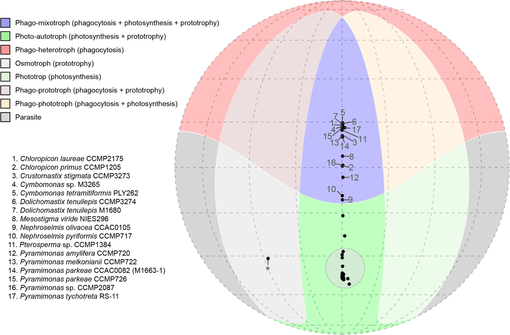
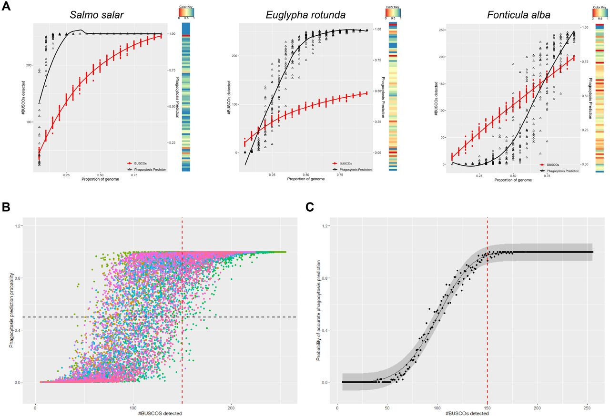
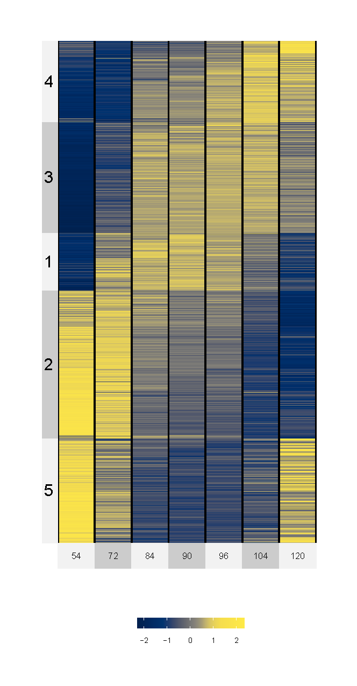
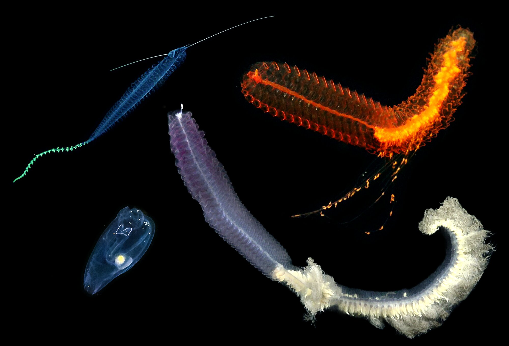

## Tools

::: {.topic}
### Predict Trophic Mode

{.topic-img fig-alt="Mollweide projection of trophic mode predictions"}

::: {.topic-body}
A computational tool to predict eukaryote function from genome or transcriptome
data. Given a set of predicted proteins, it estimates whether an organism is
phototrophic, phagotrophic, or both, without anyone having to watch the cell
feed.

[GitHub](https://github.com/burnsajohn/predictTrophicMode) ·
[Paper](https://doi.org/10.1038/s41559-018-0477-7)
:::
:::

::: {.topic}
### GenomePercPredict

{.topic-img fig-alt="Plots illustrating percent completeness calculations"}

::: {.topic-body}
Relates genome completeness to the reliability of functional predictions.

[GitHub](https://github.com/burnsajohn/GenomePercPredict) ·
[Preprint](https://doi.org/10.1101/2021.10.01.462806)
:::
:::

::: {.topic}
### Chromosphaera perkinsii transcriptomics

{.topic-img .square fig-alt="Heatmap of transcripts changing over time"}

::: {.topic-body}
Analysis scripts from work on multicellular development in a close animal
relative.

[GitHub](https://github.com/burnsajohn/Chromosphaera-perkinsii_Transcriptomics) ·
[Paper](https://doi.org/10.1038/s41586-024-08115-3)
:::
:::

## Data

::: {.topic}
### Deep-sea genomes and transcriptomes

{.topic-img fig-alt="Four deep sea animals"}

::: {.topic-body}
Sequence data from the in situ digital synthesis work: a salp genome, plus
reference transcriptome assemblies and annotations for siphonophores,
ctenophores, larvaceans, jellyfish, tunicates, and a pelagic polychaete, several
of them preserved in situ before recovery.

- Genome of [*Pegea*]{.taxon} sp., GenBank accession
  [JAQGEQ000000000](https://www.ncbi.nlm.nih.gov/nuccore/JAQGEQ000000000)
- Reads and transcriptomes, NCBI BioProject
  [PRJNA919492](https://www.ncbi.nlm.nih.gov/bioproject/PRJNA919492)
- Assemblies and annotations on Zenodo:
  [*Pegea*](https://doi.org/10.5281/zenodo.8058080) ·
  [*Tomopteris*](https://doi.org/10.5281/zenodo.8058120) ·
  [*Marrus claudanielis*](https://doi.org/10.5281/zenodo.8350091) ·
  [*Erenna*](https://doi.org/10.5281/zenodo.8058141)

Per-specimen accessions, imaging data, and library details are tabulated in the
[data paper](https://doi.org/10.1038/s41597-024-03533-4).

[Method paper](https://doi.org/10.1126/sciadv.adj4960)
:::
:::
