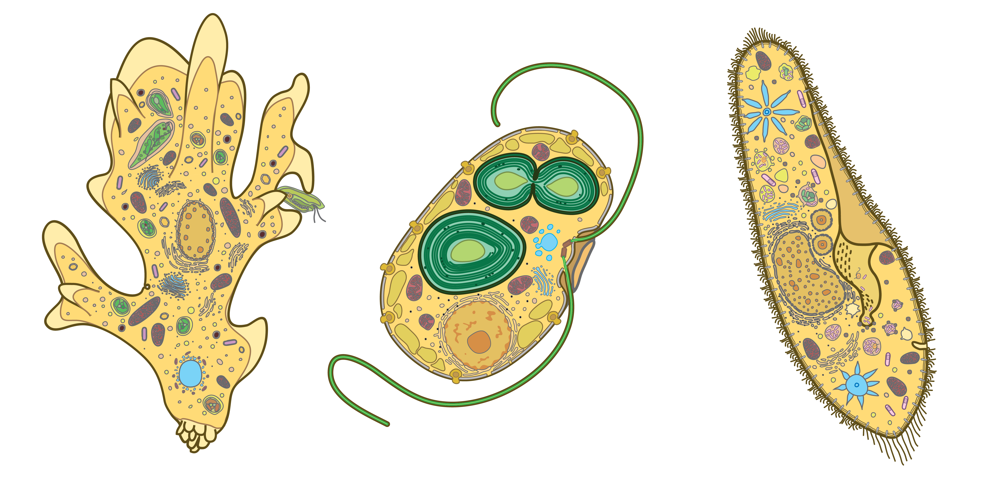
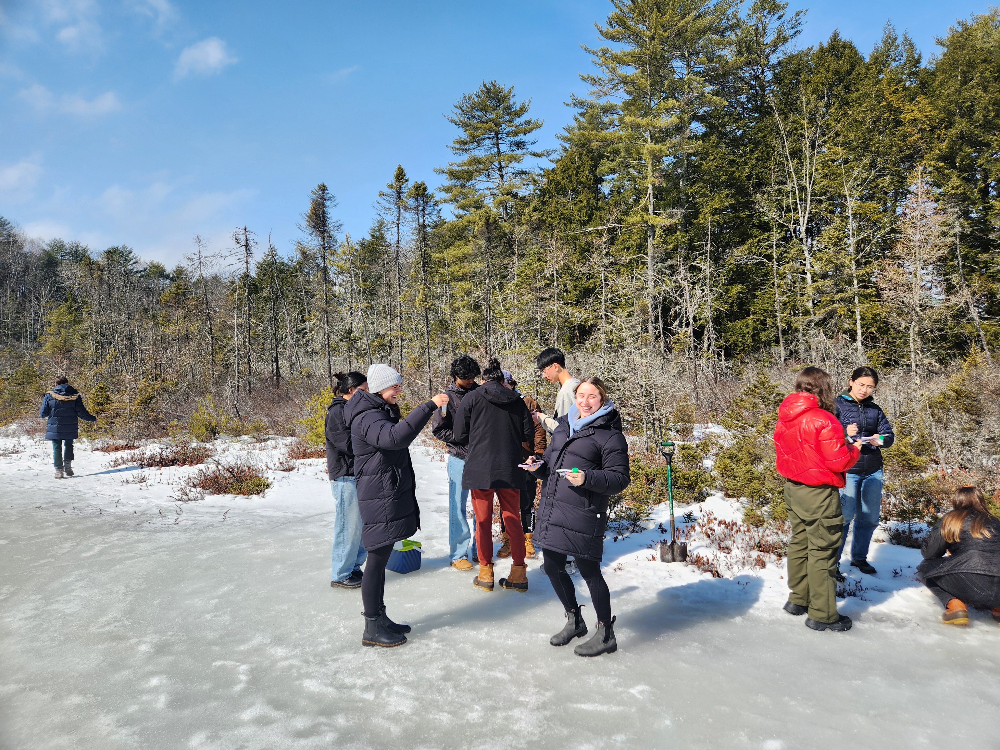
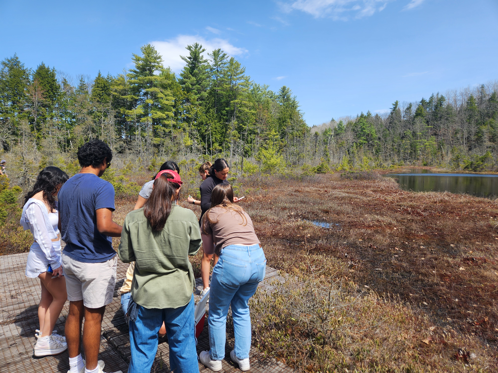
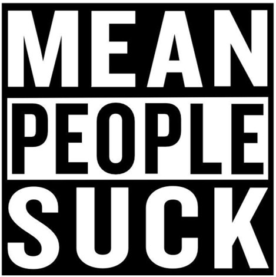

::: {.column-screen .hero-plain}
[{fig-alt="Illustrations of three protist cells"}](images/teaching/3cells.png)
:::

::: {.hero-credit}
Drawings by Yana Eglit, from [Eglit et al. 2023](https://doi.org/10.1371/journal.pbio.3002395).
:::

::: {.lead}
Cell biology is usually taught as a set of facts about animals and yeast. Most
of the diversity is elsewhere.
:::

## Evolutionary Cell Biology

[Colby College](https://www.colby.edu/academics/departments-and-programs/biology/academic-program/courses/),
developed in 2023.

::: {.figure-row}
{.figure-col fig-alt="Students sampling a frozen bog"}

::: {.figure-text}
The cell is the smallest structural and functional unit of life. This course
explores the evolution of cells through the lens of eukaryotic diversity, which
is mostly microbial. We cover the origin and evolution of eukaryotic cells,
endosymbiotic theory, cell organization, eukaryotic genomes, and the ecology of
eukaryotes. Students also learn how new microeukaryotes are found and described,
using microscopy and molecular methods, along with basic bioinformatics.
:::
:::

::: {.figure-row .figure-row-flip}
{.figure-col fig-alt="Students sampling a bog in spring"}

::: {.figure-text}
The course fulfills the field requirement for the biology major. We go out
during class time and collect from bogs, lakes, streams, ponds, and soils, then
identify what we find by microscopy and sequence it.
:::
:::

<!-- TODO: term offered, prerequisites, and a syllabus link if you want one.
     Also worth saying what a student leaves the course able to do, which is
     the thing a catalog description never covers. -->

## How I teach

**“Mean people suck.”**

{.sticker fig-alt="A bumper sticker reading 'mean people suck'"}

The class was part of a course in eighteenth- and nineteenth-century Russian
literature. The professor, an impish woman with a high-pitched voice, had read
the phrase on a bumper sticker that week and came in ready to challenge us on
what made it effective.

"Two long vowels followed by a short one that sounds like a shot!"

We had all seen the bumper sticker before and most had never given it a first, let alone second or
third thought. The class was part of a course in 18th and 19th century Russian literature. In the
class, the boorish statement, “mean people suck” morphed into an example of modern poetry and
how a variety of meanings can be conveyed in a short seemingly direct sentence. Science teaching can do the same thing.

Two ways I try. **Every fact has a history**, and saying so connects the work to
the people who did it. When I teach the salamander-alga symbiosis I start with
Henry Orr's 1888 note that the eggs "seem to present a remarkable case of
symbiosis" and the fact that his first question, how the algae get into the
eggs, is still open. **Primary literature belongs in the classroom**, at
whatever level the course allows. A 1938 genetics paper carries experimental
design, methods, and a negative result, which is more than a textbook chapter
can show about how science actually proceeds.

I also bring my current research in, which keeps me engaged in what I am
teaching and keeps students close to work that is still unfinished. In an
introductory course that means posing the question and stopping there: we study
a green alga that lives inside a salamander, the only case of its kind in a
vertebrate. Based on what you know about cells, how would you find out what is
going on? In an advanced course it means giving them the methods and having
them work out the approach themselves.

My students have gone on to PhD programs, medical school, professional work,
and to art and business school. Whatever else a course covers, they should
leave it better at writing, at reading critically, and at explaining something
to a room. Those carry down all of those paths.
